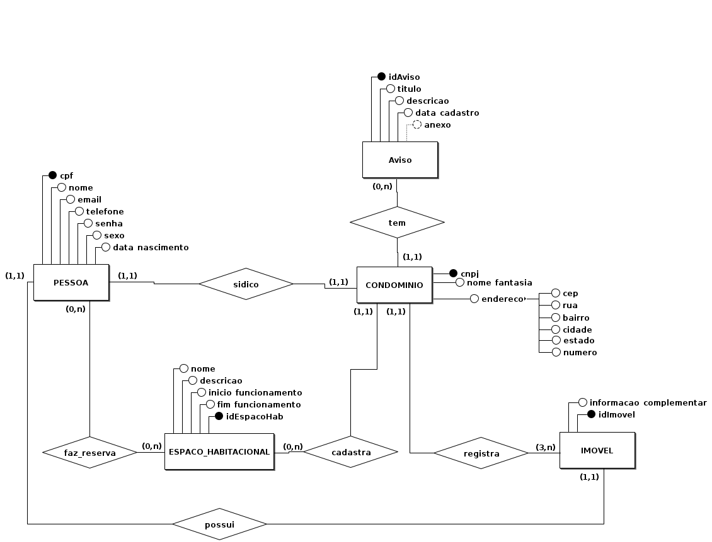
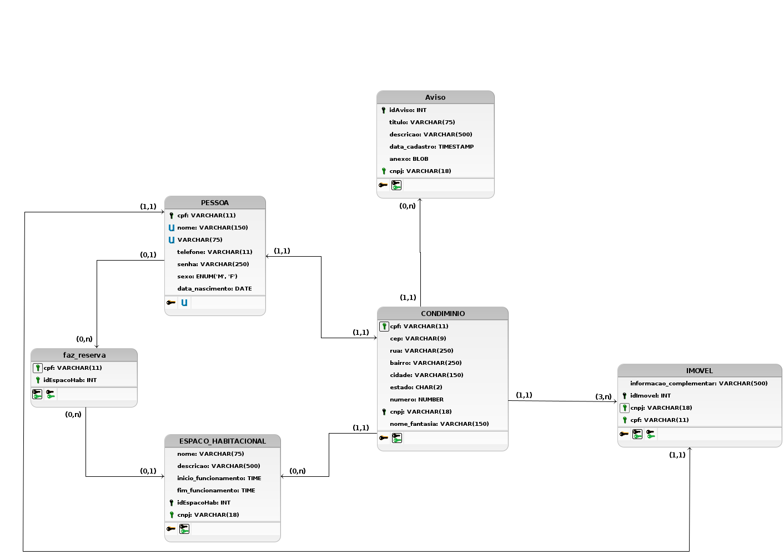

# Módulo Estilos e Padrões Arquiteturais

## 1. Histórico de Versões

| Versão | Mensagem                   | Autor        | Data       |
|--------|----------------------------|--------------|------------|
| 1.0    | Criação do Documento       | Rafael e João| 14/01/2023 |
| 1.1    | Adição da Visão de Dados   | Cristian, João e Rafael| 19/01/2023|
| 1.2    | Edita escopo e acrescenta tópicos 2.1.1 e adiciona indicação de demais tópicos do DAS  | Cristian e Rafael | 19/01/2023 |
| 1.3    | Edita ordem de alguns tópicos e acrescenta conteúdo nos tópicos 2.8 e 2.9 | Cristian |

## 2. DAS

### 2.1. Introdução

Neste documento são tratdas decisões arquiteturais tomadas pelo grupo. Ele é composto por: 
1. **Visão lógica**, voltada para apresentar a divisão dos pacotes, sistemas, classes e seus relacionamentos; 
2. **Visão de implementação**, focada mais nos padrões e modelos utilizados no momento de fazer a implementação do projeto;
3. **Visão de implantação**, traz uma ideia de em qual(is) hardwares o software seria implementado; 
4. **Visão de dados**, com a perspectiva de armazenamento dos dados, a camada de persistência da aplicação.

#### 2.1.1. Propósito

Este documento apresenta uma visão geral de como o sistema está projetado, descrevendo os seus padrões e detalhes arquiteturais utilizados quanto os requisitos e escopo do projeto. Portanto, este documento é muito relevante para a equipe de desenvolvimento, pois eles irão se basear e se orientar a partir dele.

#### 2.1.2. Escopo

O projeto **SpotHood**, trabalho da disciplina de Arquitetura e Desenho de Software(ArqDSw), é voltado para facilitar a gerência e comunicação de moradores em um **condomínio residencial**. Este trabalho terá o formato de uma aplicação web, em que uma pessoa pode logar como morador ou síndico. O morador pode verificar avisos, e realizar uma reserva de uma área comum(piscina, salão de festa, churrasqueria, entre outros) se houver. O síndico além de exercer as mesmas funções de um morador, ele poderá cadastrar avisos e áreas comuns, em que os moradores farão suas reservas de uso.

#### 2.1.3. Definições, Acrônimos e Abreviações

| Abreviação/Acrônimo| Definição    |
| ------------------ | ------------ |
| SQL - Standard Query Language | Linguagem de pesquisa declarativa padrão para banco de dados relacional  |
| SGBDR - Sistema Gerenciador de Banco de Dados Relacional               | Software responsável pelo gerenciamento do banco de dados relacional                       |
| GRASP - General Responsibility Assignment Software Patterns | Diretrizes para atribuir responsabilidade a classes e objetos em projeto orientado a objetos                      |
| GOF - Gang of Four    | Um tipo de padrão de projeto para auxiliar na criação de um software|

### 2.2. Representação Arquitetural

#### 2.2.1. Back-End

O grupo optou por utilizar no Back-End o **DJAngo**, que é um software livre e um framework web Python de alto nível que permite o rápido desenvolvimento de sites seguros [1]. O motivo de escolha dessa tecnologia deve-se pelo fato de alguns membros conhecerem muito bem o framework. Além disso, ele torna mais fácil manutenabilidade do código. 

#### 2.2.2. Front-End

O grupo optou por utilizar no Front-End o **React** que é uma biblioteca JavaScript de código aberto com foco em criar inferfaces de usuário em páginas web. O motivo de escolha dessa tecnologia deve-se pelo fato de alguns membros conhecerem muito bem o framework. Além disso, ele permite a reutilização de código e a componetização, o que torna o desenvolvimento menos complexo e reduz o tempo de codificação e manutenção.

#### 2.2.3. Banco de Dados

Para o banco de dados utilizamos do Postgres v.11 que é um sistema de gerenciamento banco de dados, que utiliza da linguagem SQL. É um SGBDR de código aberto muito utilizado pela comunidade e também com muita ajuda para resolução de conflitos e problemas online.

### 2.3. Metas e Restrições de Arquitetura

#### 2.3.1. Metas

| Restrições     | Descrição                                             |
| ------------- | ---------------------------------------------------------------- |
| Segurança | O sistema deve garantir a integridade e segurança dos dados coletados pela aplicação, sempre validando qualquer nova entrada |
| Usabilidade | O sistema deve proporcionar maior conforto e facilidade ao usuário quando este requisita suas funcionalidades |
| Suportabilidade | O sistema deve funcionar primariamente para desktops e notebooks e rodar nos navegadores web nas suas atualizações mais atuais |
| Escalabilidade | O sistema deve permitir que novas evoluções sejam implementadas conforme o desejado |

#### 2.3.2. Restrições

| Restrições     | Descrição                                             |
| ------------- | ---------------------------------------------------------------- |
| Cadastro de Contas | Não poderão ser criadas contas com cpfs que já estejam vinculados a uma conta existente |
| Cadastro de Condomínios | Não poderão ser criados condomínios com cnpjs que já estejam vinculados a outro condomínio existente na plataforma |
| Limite de imóveis | Um morador não pode ter mais de um imóvel dentro do condomínio |        
| Conectividade | É necessário ter conexão com a internet para utilizar a aplicação.                                                |
| Idioma        | O sistema deve ser desenvolvido para o idioma português do Brasil.                                                |
| Público       | O projeto deve ser desenvolvido para pessoas que desejam ter um melhor controle e conhecimento sobre o que está acontecendo no condomínio onde mora|
| Plataforma    | A aplicação será utilizada em plataformas web, tais como Google Chrome, FireFox, Brave, entre outros.      |
| Prazo Final   | O escopo do projeto deve ser finalizado até o final da disciplina.   |

### 2.4. Visão Lógica
-

### 2.5. Visão de Processos
-

### 2.6. Visão de Implantação (ou Implementação)
-

### 2.7. Visão de Dados
É uma especialização da visão lógica, que descreve como o sistema é estruturado, com o foco nos dados da aplicação. A ideia principal é que essa visão seja utilizada se a persistência for um aspecto realmente significativo, onde ha a necessidade de armazenar dados.

Neste projeto, o banco de dados ficou responsável por armazenar as informações dos moradores e como elas se relacionam com o restante do escopo da aplicação.

Serão evidenciados o Diagrama Entidade-Relacionamento(DE-R) e o Diagrama Lógico de Dados(DLD)

<h6 align='center'>Figura X: DE-R V.3<h6/>

<h6 align='center'>Fonte: Autoria do grupo<h6/>

<h6 align='center'>Figura X+1: DLD V.2<h6/>

<h6 align='center'>Fonte: Autoria do grupo<h6/>
<h6 align='left'>

OBS.: As versões anteriores podem ser encontradas no caminho /docs/assets/SGBD_Diagramas

<h6/>

### 2.8. Tamanho e Performance
O projeto SpotHood e todos os seus arquivos e códigos somados não deverão ultrapassar os 1GB de armazenamento em uma máquina e, por se tratar de uma aplicação WEB e por ser focada em máquinas desktop, não é preciso nenhuma instalação por parte do usuário, apenas o seu acesso à internet. 

### 2.9. Qualidade De Software
A qualidade de um software pode ser medida através de parâmetros definidos pela norma ISO/IEC 9126-1[2], sendo estes:

 - **Funcionalidades**:  Satisfação do que foi pedido
 - **Confiabilidade**: Capacidade do sistema de resistir a falhas e de se recuperar
 - **Usabilidade**: Facilidade de uso da aplicação pelo usuário
 - **Eficiência**: O desempenho de uma aplicação em cumprir o que lhe foi pedido
 - **Manutenção**: Facilidade em corrigir eventuais falhas que possam ocorrer
 - **Portabilidade**: Mobilidade da aplicação de ser utilizada em ambientes diferentes

Para cada aspecto desta norma, a aplicação SpotHood foi avaliada da seguinte forma:

| Aspecto | Avaliação |
| :-----: | :-------: |
|**Funcionalidades**||
|**Confiabilidade**||
|**Usabilidade**||
|**Eficiência**||
|**Manutenção**||
|**Portabilidade**||

## 3. Referências
[1] mozila.org. Introdução ao Django. Disponível em: <https://developer.mozilla.org/pt-BR/docs/Learn/Server-side/Django/Introduction>. Acesso em 14 de janeiro de 2023

[2] linhadecodigo. Quais são as Reais Características da Qualidade da NBR ISO/IEC 9126-1? Disponível em: <http://www.linhadecodigo.com.br/artigo/1444/quais-sao-as-reais-caracteristicas-da-qualidade-da-nbr-iso_iec-9126-1.aspx>

<!--
**Foco_01:** Documento de Arquitetura.

Entrega Mínina: DAS, com as visões: Lógica, Implementação,
Implantação, e Dados (caso tenha camada de persistência).

Apresentação (em sala) explicando o Documento de Arquitetura (DAS), com: (i) rastro claro aos membros participantes; (ii) justificativas & senso crítico sobre esse artefato, em especial detalhando os estilos e padrões arquiteturais estabelecidos ao projeto; (iii) breve apresentação pelo menos das visões: Lógica, Implementação, Implantação, e Dados (caso tenha camada de persistência), e (iv) comentários gerais sobre iniciativas extras. Tempo da Apresentação: +/- 10min. Recomendação: Apresentar diretamente via Wiki ou GitPages do Projeto.

A Wiki ou GitPages do Projeto deve conter um tópico dedicado ao Módulo Estilos e Padrões Arquiteturais, com DAS, histórico de versões, referências, e demais detalhamentos gerados pela equipe nesse escopo.

Lembrando, trata-se da ENTREGA FINAL DO PROJETO. Então, o DAS (portanto, a apresentação em sala de aula também) deve abordar os artefatos elaborados ao longo do semestre como um todo, organizando-os em cada Visão.

Demais orientações disponíveis nas Diretrizes (vide Moodle).
-->

