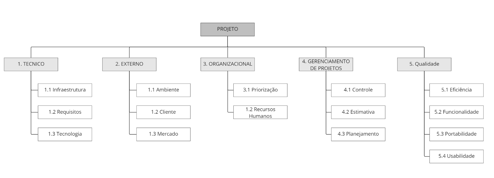

# Plano de Gerenciamento de Riscos

## 1. Introdução

Este documento visa conduzir como será as atividades de Gerenciamento de Riscos deste projeto.
Gerenciamento de Risco define como será identificado, controlado e mantido os riscos previstos para o projeto.
Separando os riscos em categorias organizacional, gerencia de projeto, técnico, qualidade e externo.
Também pode ser separado em graus de Probabilidade e Impacto.

## 2. Estrutura Analítica dos Riscos

<h6 align='center'>Figura 1: Estrutura Analítica dos Riscos</h6>

## 3. Processo para Gerenciamento de Riscos

O processo de gerenciamento de riscos dá a visão do que será realizado com relação aos riscos.

- **Identificar Riscos:** Consiste em elencar os riscos que podem afetar o desenvolver do projeto. Além de listá-los procura-se entender algumas de suas características para que sejam analisadas posteriormente.
- **Analisar qualitativamente:** Nesta etapa são aplicadas métricas de impacto e probabilidade aos riscos a fim de obter uma compreensão maior sobre eles.
- **Analisar quantitativamente:** Consiste em analisar de forma numérica os riscos para investigar melhor as métricas definidas no processo anterior.
- **Planejar respostas:** Com base na análise feita, é estipulado um conjunto de ações a serem tomadas de acordo com cada risco.
- **Monitorar:** Consiste em controlar os riscos durante o projeto, avaliando as suas causas. Uma prática que pode ser adotada nesta atividade é atribuir pessoas responsáveis por realizar o monitoramento.

## 4. Categoria de Riscos

### 4.1. Técnico
- **Infraestrutura:** Um dos pontos mais críticos do gerenciamento de riscos em projetos de software, pois geralmente nos esquecemos de providenciar com antecedência a infraestrutura onde o software será executado. É um ponto crítico de conflitos entre a área de infraestrutura, suporte e desenvolvimento.
- **Requisitos:** Riscos relacionados aos requisitos levantados e ao escopo definido;
- **Tecnologia:** É relativo a riscos relacionados às tecnologias e ferramentas utilizadas no projeto.

### 4.2. Externos
- **Ambiente:** O ambiente pode influenciar no desempenho da equipe e no desenvolvimento do produto, um exemplo aplicado ao nosso projeto é o fato de a maior parte do desenvolvimento acontecer na FGA e uma das limitações que pode ocorrer é a falta da internet ou a realização greves.
- **Cliente:** Diz respeito aos riscos relacionados com o cliente, como aprovação da solução. No caso do "A Monitoria" a sazonalidade do uso do produto pode representar um risco.
- **Mercado:** Baixa adesão dos usuários a aplicação, risco relacionado à utilização e evolução do projeto no mercado.

### 4.3. Organizacional
- **Priorização:** São riscos relacionados aos erros de priorização, gerando atrasos nas entregas, por existir dependências entre as tarefas.
- **Recursos Humanos:** Corresponde aos riscos relacionados aos recursos humanos, bem como o comprometimento da equipe de desenvolvimento e falta de comunicação entre as partes envolvidas.

### 4.4. Gerencia de projeto
- **Controle:** São riscos referentes a falta de ação sobre riscos identificados.
- **Estimativa:** São erros que dizem respeito a erros de estimativa, como por exemplo erros de pontuação de histórias de usuário.
- **Planejamento:** São riscos relacionados a erros de planejamento, como tarefas grandes em períodos curtos.

### 4.5. Qualidade
- **Eficiência:** Garantir que o usuário consiga ter as respostas da aplicação de forma rápida e coesa.
- **Funcionalidade:** Contempla tudo relacionado à funcionalidade do software, como garantir que os requisitos foram atendidos de forma satisfatória, garantir que atende a real necessidade do usuário e se retornará resultados precisos.
- **Portabilidade:** Se refere a que plataformas/sistemas operacionais o software irá rodar e como será feita a compatibilidade.
- **Usabilidade:** A usabilidade engloba todos os aspectos referentes à interface com o usuário, que se sinta a vontade com o uso do sistema e que o entenda, com o mínimo de treinamento.

## 5. Definição de Probabilidade, Impacto e Matriz de Impacto

O critério de probabilidade é uma estipulação de um potêncial risco vir a acontecer. Enquanto o critério de Impacto, é o quanto este risco irá impactar no projeto em questões de tempo, capacitação, mão de obra e custos.

Os critérios acima ajudam a definir a Matriz de Probabilidade e Impacto, que auxiliará a priorização de resolução dos riscos.

### 5.1. Probabilidade

Probabilidade | Intervalo | Peso
:-:|:-:|:-:
Muito Baixa | 0% até 20%   | 1
Baixa       | 20% até 40%  | 2
Moderada    | 40% até 60%  | 3
Alta        | 60% até 80%  | 4
Muito Alta  | 80% até 100% | 5

<h6 align="center">Tabela 1 - Probabilidade: Autoria Própria</h6>

### 5.2. Impacto

Impacto | Descrição | Peso
:-:|:-:|:-:
Muito Baixo | Quase impercepitível                      | 1
Baixo       | Pouca influência                          | 2
Moderado    | Notável, sem consequência                 | 3
Alto        | Notável e dificulta o desenvolvimento     | 4
Muito Alto  | Notável e impossibilita o desenvolvimento | 5

<h6 align="center">Tabela 2 - Impacto: Autoria Própria</h6>

### 5.3. Matriz de Probabilidade e Impacto

P\I | Muito Baixo | Baixo | Moderado | Alto | Muito Alto
:-:|:-:|:-:|:-:|:-:|:-:
Muito Baixa | 1 |  2 |  3 |  4 |  5
Baixa       | 2 |  4 |  6 |  8 | 10
Moderada    | 3 |  6 |  8 | 12 | 15
Alta        | 4 |  8 | 12 | 16 | 20
Muito Alta  | 5 | 10 | 15 | 20 | 25

<h6 align="center">Tabela 3 - Matriz de Probabilidade e Impacto: Autoria Própria</h6>

## 6. Riscos do Projeto

Risco | Causa | Descrição | Impacto | Prevenção | Prioridade
:-:|:-:|:-:|:-:|:-:|:-:
RO1 | Perda de Equipe | Devido o projeto ser um trabalho de faculdade, os desenvolvedores podem se desmotivar no decorrer do semestre, retirar disciplina ou não priorizar o desenvolvimento do projeto | A diminuição da equipe irá fazer com que a divisão de tarefas sejam remanejadas entre os demais  participantes | Incentivar a equipe, e tentar manter o peso das tarefas compativeis com a realidade da equipe | 8~15
RO2 | Falta de comunicação da equipe | Os membros não discutirem sobre a ideia do projeto, e cada um ter uma perspectiva do que deve ser desenvolvido | Ter uma aplicação com diversas incoerências | Estabelecer uma boa comunicação e reuniões de ponto de controle | 8

<h6 align="center">Tabela 4 - Riscos Organizacional: Autoria Própria</h6>

Risco | Causa | Descrição | Impacto | Prevenção | Prioridade
:-:|:-:|:-:|:-:|:-:|:-:
RGP1 | Escopo Errado | O Escopo ter sido definido errado | Haver necessidade de redefinir o escopo, e se após o início do desenvolvimento, haver retrabalho | Definir bem o escopo no início do projeto | 10
RGP2 | Cronograma Irreal | Cronograma de Tarefas não estar coerente com a realidade da equipe | Haver muito ou pouco peso nas tarefas que a equipe pode entregar no decorrer do desenvolvimento | Acompanhar grau de dificuldade para cada feature adicionado ao projeto | 10

<h6 align="center">Tabela 5 - Riscos de Gerência do Projeto: Autoria Própria</h6>

Risco | Causa | Descrição | Impacto | Prevenção | Prioridade
:-:|:-:|:-:|:-:|:-:|:-:
RT1 | Inexperiência com Tecnologia | A equipe não ter experiência o suficiente com a tecnologia para a produção do Projeto | A equipe ter que despender muito tempo para começar o desenvolvimento do projeto | Fazer um mapa de tecnologias, e ver aquelas que a equipe possui mais afinidade, e haver um treinamento antes de começar o desenvolvimento | 8
RT2 | Atraso nas Entregas | A equipe não conseguir seguir com o cronograma proposto para o projeto | Atraso no desenvolvimento, e na entrega do produto final | Estabelecer bem o escopo do projeto, e fazer um cronograma que se adeque a realidade da equipe | 16

<h6 align="center">Tabela 6 - Riscos Técnico: Autoria Própria</h6>

Risco | Causa | Descrição | Impacto | Prevenção | Prioridade
:-:|:-:|:-:|:-:|:-:|:-:
RQ1 | Bug | O produto possuir bugs notáveis pelo usuário comum |  | Fazer testes no desenvolvimento | 5
RQ2 | Falha | O produto não funcionar para o usuário comum |  | Fazer testes e verificar o deploy | 10

<h6 align="center">Tabela 7 - Riscos de Qualidade: Autoria Própria</h6>

Risco | Causa | Descrição | Impacto | Prevenção | Prioridade
:-:|:-:|:-|-|-|:-:
RE1 | Falta de Validação de Potencial Cliente | Não conseguir contactar uma pessoa envolvida como dono de condominio e síndico, para apresentar o nosso produto e ele fazer validação | Ter uma validação enviesada pela equipe | Buscar Potencial Cliente | 5 | 

<h6 align="center">Tabela 8 - Riscos Externos: Autoria Própria</h6>

## 7. Referências
[1] Gerenciamento dos Riscos: Processo - Planejar o gerenciamento dos riscos; Autor:ESO edX; Data: 19/09/2016; Disponível em:<https://www.youtube.com/watch?v=HDMS7ftQJb0&t=2s> Acessado em 14/11/22  

[2] Plano de Riscos: SpaceShooter; Autor: DesenhoMaster2017; Data: 25/11/2017; Disponível em: <https://github.com/DesenhoMaster2017/SpaceShooter/wiki/Plano-de-Riscos> Acessado em 14/11/22  

[3] Controle de Riscos: A Monitoria; Autor:A Monitoria - ADS 2019.2; Data: 2019.2; Disponível em:<https://2019-2-arquitetura-desenho.github.io/wiki/dinamica_seminario_II/controle_riscos/> Acessado em 14/11/22

## 8. Histórico de versões

| Versão |   Data   |                   Alteração                    | Participantes  |
| :----: | :------: | :--------------------------------------------: | :---------:    |
| 1.0  | 16/11/22 |              Criação do documento              | Rodrigo Santos |
| 1.1  | 17/11/22 |               Adição de conteudo               | Mariana Rio    |