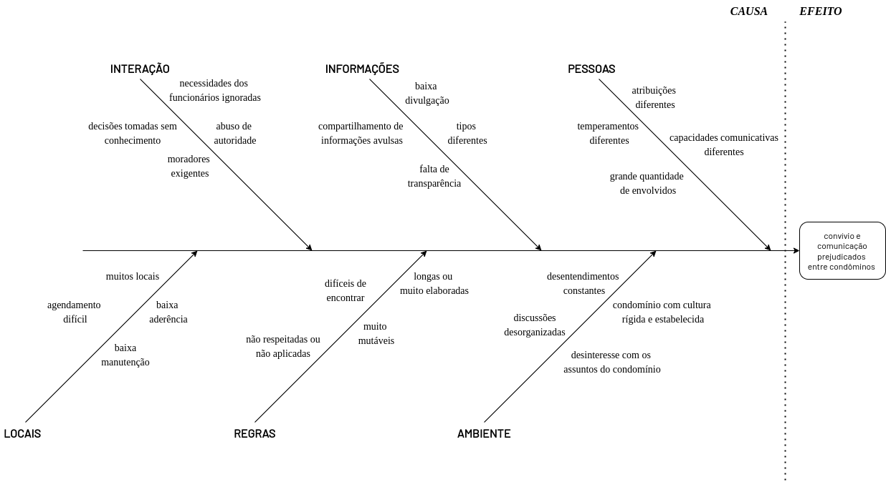

# Diagrama de Ishikawa

## 1. Introdução

### 1.1 O que é um Diagrama de Ishikawa
O Diagrama de Ishikawa, também conhecido como Diagrama Espinha de Peixe, é uma ferramenta que ajuda as pessoas a identificar possíveis causas para problemas

## 2. Diagrama Criado

<h6 align='center'>Figura 1: Diagrama Ishikawa<h6/>

## 3. Referências
> Construção do Diagrama: Ferramenta da Qualidade; Autor:
Aprendendo Gestão; Data: 23/09/2016; Link: https://www.youtube.com/watch?v=U-0qzmFqH-0&t=4s; Acessado em 17/11/2022.

## 4. Histórico de versões

| Versão |   Data   |                   Alteração                    | Participantes |
| :----: | :------: | :--------------------------------------------: | :---------: |
| 0.0.1  | 17/11/22 |              Criação do documento e conteudo              | Mariana Rio |
| 0.0.2  | 17/11/22 |              Criação do diagrama              | 	Vinicius Edwardo |
