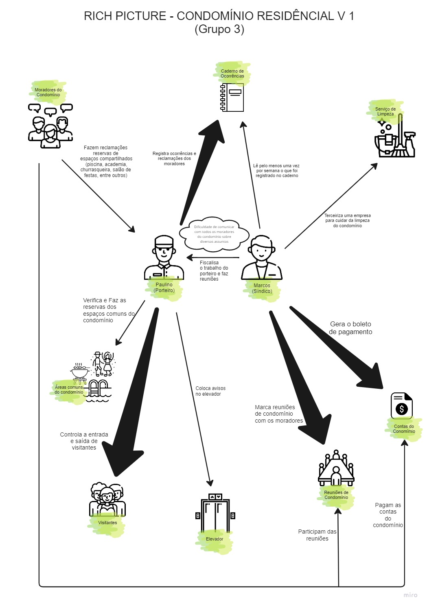

# 1.1.1. Rich Picture
## 1. **Introdução**
É um desenho responsável por representar um situação que ilustra os principais elementos e relações que precisam ser consideradas para bolar uma solução [2]. Em outras palavras, o Rich Picture ajuda a tornar explicito aos stakeholders suas inter relações e preocupações [1]. Basicamente, consite em: imagens, textos curtos, símbolos e icones que ilustram graficamente a situação [1].

## 2. **Artefato**

Veja mais de perto: [here](../assets/RichPicture.pdf)

## 3. **Fontes**

Sindico: <https://www.flaticon.com/br/icone-gratis/masculino_3209188>

Reuniao: <https://www.flaticon.com/br/icone-gratis/reuniao-do-conselho_2680422>

Porteiro: <https://www.flaticon.com/br/icone-gratis/mensageiro-de-hotel_2933756>

Areas Comuns do condominio (salão de festa): <https://www.flaticon.com/br/icone-gratis/anca_3034126>

Areas Comuns do condominio (churrasco): <https://www.flaticon.com/br/icone-gratis/churrasco_3725555>

Areas Comuns do condominio (piscina):  <https://www.flaticon.com/br/icone-gratis/danca_3034126>

Contas do Condomínio: <https://www.flaticon.com/br/icone-gratis/forma-de-pagamento_3986210>

Moradores do Condomínio: <https://www.flaticon.com/br/icone-gratis/conversa_1989884>

Caderno de ocorrencias: <https://www.flaticon.com/br/icone-gratis/caderno_5088684>

Visitantes: <https://www.flaticon.com/br/icone-gratis/convidados_6454552>

Serviço de Limpeza: <https://www.flaticon.com/br/icone-gratis/ferramentas-de-limpeza_4221310>

Elevador: <https://www.flaticon.com/br/icone-gratis/elevador_263002>

## 4. Referências

[1] MONK, Andrew; HOWARD, Steve. Methods & tools: the rich picture: a tool for reasoning about work context. interactions, v. 5, n. 2, p. 21-30, 1998.

[2] mpsguide. Rich Picture. Disponível em <https://mspguide.org/2022/03/18/rich-picture/> acesso em 13 de novembro

## 5. Histórico de versões

| Versão | Data| Modificação|Autor|
| :--: | :--: | :--: | :--:|
| 1.0    | 13/11/2022 | Criação do documento e artefato | Rafael Berto Pereira
| 1.1    | 16/11/2022 | Retira tópico 'requisitos elicitados' | Cristian Furtado