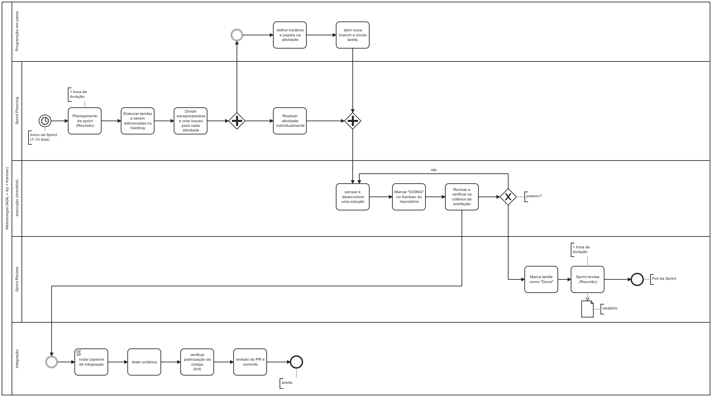

# Processos Metodologias e Abordagens

## 1. **Introdução**

Nesse módulo iremos abordar três conceitos que podem ser entendidos com um conjunto de atividades, práticas ou diretrizes que visam auxiliar no processo de desenvolvimento de um Software.

## 2. **Metodologias  Abordagens e Processos**
As metodologias, abordagens e processos se diferenciam pela sua flexibilidade e rigor, mas todas são podem ser entendidas como práticas que buscam agilizar o desenvolvimento de um projeto. Assim, as metodologias tem um papel fundamental na produtividade das equipes e vem ganhando cada vez mais importância.

O uso de métodos ágeis promove melhor comunicação, conhecimento, organização e bem estar da equipe. Desse modo podemos incluir toda a equipe e o cliente entro desse processo.

## 3. **Escolha da(s) metodologia(s)**
Construir ou evoluir um software com o mínimos de erros, dentro do prazo e custos pré-estabelecidos não é uma tarefa fácil. Para isso, as metodologias ágeis trouxeram grande ajuda

Porém, ainda é dificil se adaptar a tantos processos. A combinação de metodologias, sejam elas tradicionais ou ágeis, permite eliminar essa complexidade desnecessária. Para as metodologias ágeis e processo de combinação é mais fácil uma vez que ambas possuem muitas características em comum.

### 3.1 **SCRUM**
A escolha do Scrum deve-se ao uso de *Sprints* que funcionam em pequenos ciclos de 7-10 dias (tempo determinado préviamente pela equipe). Esses ciclos ajudam a manter o controle dos prazos de entrega.

* **Sprint planning:** Realizado nas terças ou quintas para planejar as da semana.

* **Sprint Review:** Realizados nas terças ou quintas para checar o andamento da equipe com as atividades da semana.

* **Produto Backlog:** Lista de ideias e recursos que devem ser completados ao longo da semana.

### 3.2 **Kanban**
Faremos uso de *Checklists* que é uma abordagem muito simples e efetiva facilidando muito a aderência pela equipe. Para acompanhar as atividades usaremos um quadro e dividi-lo em:

* **TO DO** - Atividades que ainda precisam ser realizadas.
* **Doing** - Atividades em andamento.
* **Done** - Atividades que foram finalizadas e aprovadas pela equipe.

### 3.3. **XP**
A metodologia XP, por ser um método de desenvolvimento que preza o bem estar da equipe e a confiabilidade do produto. Adotamos algumas boas práticas como:

* **Pair Programming(programação em pares):** é uma pratica que ajuda a nivelar o nível de conhecimento da equipe e garantindo códigos mais robustos com duas linhas de pensamento alinhadas.

* **Integração contínua:** Utilizaremos ferramentas de teste unitário para melhor manutenabilidade do software.

* **Padronização do código:** Todo código é desenvolvido seguindo um padrão, qualquer que seja, mas toda equipe deve seguir o mesmo padrão. Dessa forma, todos da equipe terão a mesma visão do código.

## 4. **Escolha dos Artefatos**
A escolha dos artefatos deve-se a sua simplicidade e eficência. Xp, SCUM e Kanabn costumam ser os favoritos para projetos de curto prazo que visam maior flexibilidade.

Outro motivo da escolha é devido a familiaridade do grupo com tais abordagens. O simples fato de todos integrantes do grupo já estarem envolvidos em projetos que aplicavam os artefatos apresentados.

## 5. **Modelagem BPMN**
A modelagem BPMN é um diagrama que modela os processos  de negócio do produto. Nele contém um fluxograma que passa por cada etapa dentro de um processo.

Elaboramos um fluxograma que especifica nossa abordagem metodológica. Utilizamos como ponto de início do evento nossas sprints e usamos tarefas e *gateways* para especificar ações e decisões tomadas.

Veja mais de perto: [here](../assets/diagram.pdf)

## 6. Comunicação

Devido ao tamanho do grupo e o trabalho exigir horas extra classe . Para isso utilizamos de ferramentas para auxiliar na comunicação do time.

### 6.1. Discord

O Discord é uma das maiores ferramentas de comunicação do time. Foi criado um servidor somente para a interação da equipe, utilizado para reuniões e pareamentos, também foi instaciado um webhook, para receber notificações do GitHub.

Também é utilizado o servidor da disciplina, onde é feita a comunicação com os clientes do projeto e o professor.

### 6.2 Telegram

Além do Discord a comunicação do time também é feita pelo telegram, onde são feitas discussões mais objetivas.

## 7. Referências bibliográficas

> Deisy Braz S., COMBINAÇÃO DE MÉTODOS ÁGEIS NO PROCESSO DE DESENVOLVIMENTO DE SOFTWARE: UM ESTUDO DE CASO. Disponível em: <https://periodicos.uniarp.edu.br/index.php/ignis/article/download/1133/570/4664>, acessado em 14/11/2022.

> SCRUM. Disponível em: <http://www.desenvolvimentoagil.com.br/scrum/>, acessado em 14/11/2022.

> T.L., Métodos ágeis: o que são e como impactam o seu negócio?, Disponível em: <https://www.lumis.com.br/a-lumis/blog/metodos-ageis.htm#:~:text=As%20metodologias%20%C3%A1geis%20s%C3%A3o%20uma,revistos%20com%20os%20m%C3%A9todos%20%C3%A1geis.>, acessado em 14/11/2022.

> Object Management Group
Business Process Model and Notation, Disponível em: <https://www.bpmn.org/>, acesado em: 14/11/2022.

> Prof. Milene Serrano, disciplina Arquitetura e Desenho de Software. Base - Metodologia, BPMN. acessado em 14/11/2022 via aprender.

> Documentação de anos anteriores, disponível em: <https://unbarqdsw.github.io/2020.1_G6_Pomo/img/bpmn/bpmn_metodologia_v1.png>, acessado em: 15/11/2022

## 8. Versionamento

| Versão | Data| Modificação|Autor|
| :--: | :--: | :--: | :--:|
| 1.0    | 14/11/2022 | Criação do documento e metodologias | Victor Yukio Cavalcanti Miki