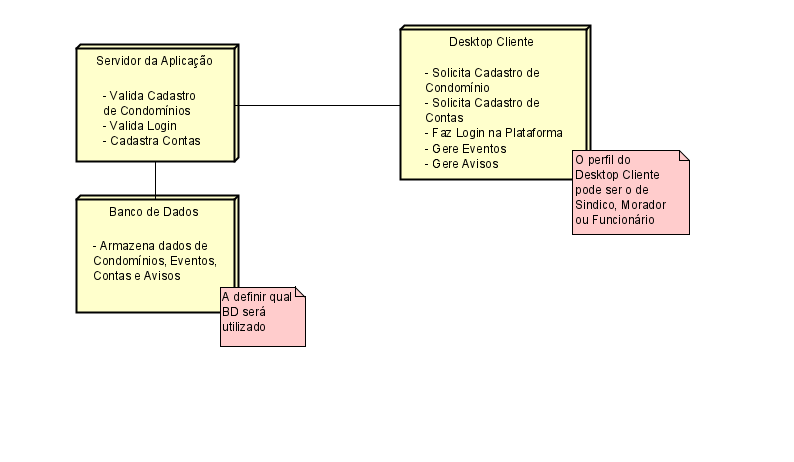

# Diagrama de Atividades

## 1. Introdução
É um tipo de diagramação UML focado em dar um panorama geral do ambiente em que a aplicação estará situada, assim mostrando padrões arquiteturais que serão adotados com os componentes que participarão da aplicação e como será a interação entre eles, podendo ser estes computadores, sistemas de banco de dados até sensores e outros hardwares e softwares.[1] Este tipo de diagrama é ideal para modelar sistemas incorporados por hardwares de estímulo externo, cliente/servidores e também para sistemas distribuídos com vários servidores, permitindo assim avaliar como os recursos computacionais estão alocados dentro da aplicação e susas dependências[3]

## 2. Metodologia
Foram reunidos 2 integrantes para realizar a execução deste artefato e um para revisar o trabalho feito. Foi utilizado o programa Astah para modelagem deste diagrama (cujo arquivo original se encontra na pasta 'assets') . Os integrantes envolvidos na elaboração do artefato optaram por seguir uma linha mais simples e abstraída, utilizando como exemplo um dos diagramas presentes no site da Creately[2]. 

## 3. Artefato Desenvolvido
Este artefato representa a visão bem generalista do ambiente da nossa aplicação, onde teremos um Desktop cliente (podendo ser o usuário dele um Síndico, um Funcionário ou um Morador) que se comunicará com o servidor da nossa aplicação, que será responsável por guardar e recuperar dados enviados deste cliente em um banco de dados.

## 4. Referências

[1] Curso de UML - Diagrama de Implantação. Professor Paiva. Disponível em <https://youtu.be/DgERD0HgggQ> acesso em 5 de dezembro.

[2] O Guia Fácil de Diagramas de Implantação UML. Creately. Disponível em <https://creately.com/blog/pt/diagrama/tutorial-do-diagrama-de-implantacao/> acesso em 5 de dezembro.

[3] Diagramas de Implementação. IBM. Disponível em <https://www.ibm.com/docs/pt-br/rsas/7.5.0?topic=topologies-deployment-diagrams> acesso em 5 de dezembro.

## 5. Histórico de versões
  
| Versão | Mensagem                   | Autor        | Revisor       | Data       |
|--------|----------------------------|--------------|---------------|------------|
| 1.0    | Criação do Documento e adição de conteúdo | Cristian, Mariana | Rodrigo | 5/12/2022 |
| 1.1    | Edição de documento e adição de nova referência | Cristian, Mariana | - | 5/12/2022 |
