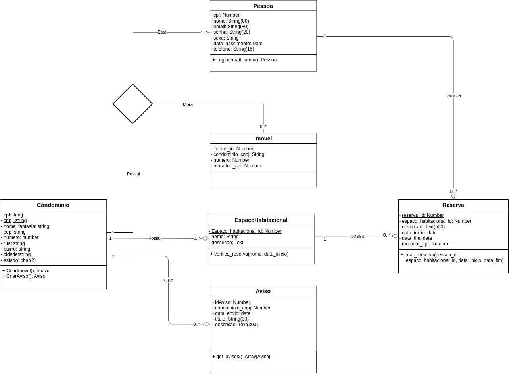

# Diagrama de Classes
## 1. Introdução  
O diagrama de classe representa uma visão estática do nosso sistema através de objetos, operações, relações e atributos. Nele descrevemos de forma mais clara oque deve estar presente na modelagem do nosso banco de dados. Antes de seguir veremos oque são as classes, que é o foco do nosso objeto de estudo.

**Classes**: As classes são como objetos que possuem estruturas internas chamadas de atributos e métodos. Eles representam uma entidade do nosso modelo de negócio, seja uma pessoa, lugar ou ferramenta

**Atributo**: Os atributos são características que compoem nossa classes. São elas que guardam as informações que seram consultadas dentro da classe.

**Métodos**: Os métodos são operações ou funções que as classes sofre ou realiza. Muito utilizado para acessar, alterar ou manipular métodos da classe. 

## 2. Metodologia
Para confecção do nosso diagrama de classe criamos alguns stories boards e criamos vários fluxos possíveis de serem realizados. Além disso, mapeamos nossas classes e marcamos tudo que poderia e deveria ser armazenado no nosso banco.

Como ferramenta de auxílio usamos o Miro para desenhar e compartilhar nossas ideias.

Assim, em grupo discutimos e elaboramos nosso diagrama.

## 3. Diagrama

## 4. Referências

> José Carlos Macoratti, UML Diagrama de Classes e Objetos. Disponível em: <https://www.macoratti.net/net_uml1.htm>, acessado em 3/12/2022.

> José Fernando Rodrigues Jr (ICMC/USP), Unified Modeling Language
(UML). Disponível em: <https://edisciplinas.usp.br/pluginfile.php/4247716/mod_resource/content/1/Aula3_UML.pdf>, acessado em 3/12/2022.

## 5. Histórico de versões
  
| Versão | Mensagem                                                 | Autor        | Revisor       | Data       |
|--------|----------------------------------------------------------|--------------|---------------|------------|
| 1.0    | Criação do Documento                                     | Levi Queiroz | - | 30/11/2022 |
| 1.1 | introdução, metodologia, diagrama, referência | Cristian, Rodrigo, Victor |  Victor  | 03/12/2022
| 1.2 | Atualizar diagrama de classe | Victor | a definir | 29/01/2022 