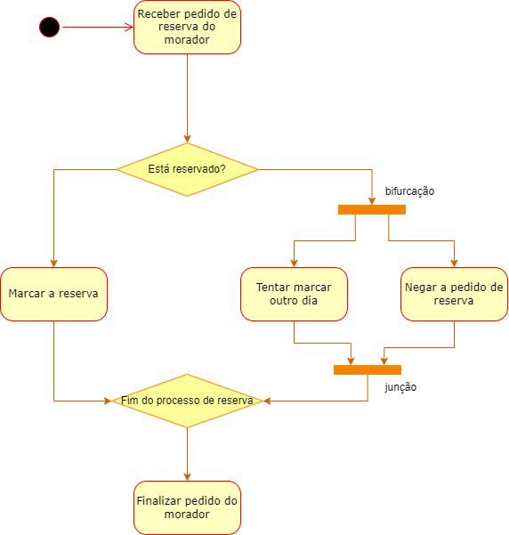
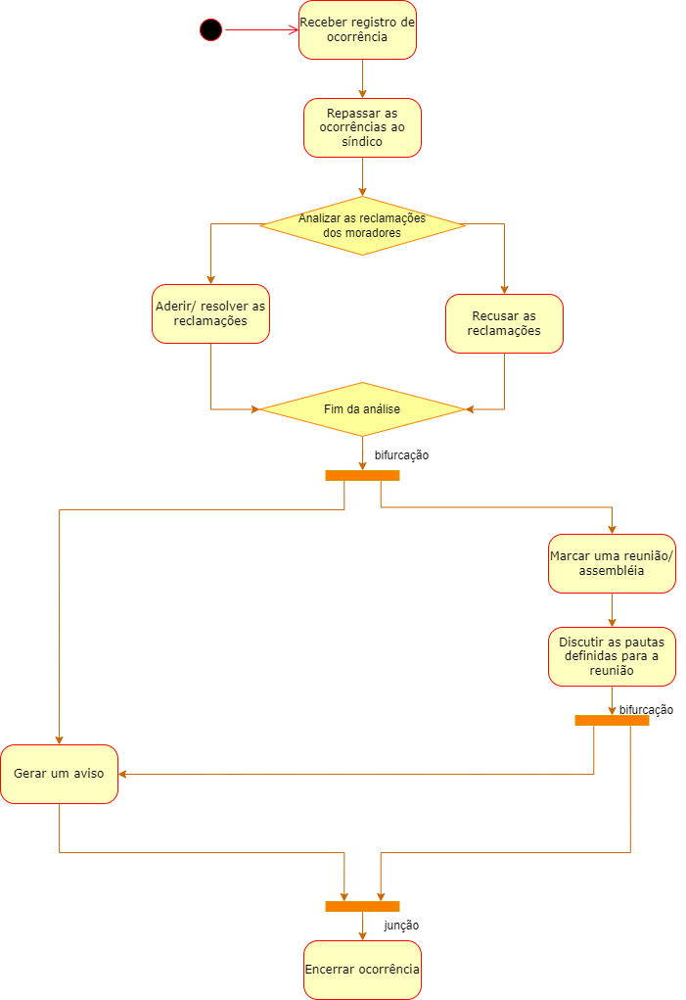

# Diagrama de Atividades

## 1. Introdução

## 2. Metodologia

## 3. Artefatos Desenvolvidos

### 3.1 Diagrama Focado em Reservas

### 3.2 Diagrama Focado em Ocorrências

## 4. Referências

## 5. Histórico de versões
  
| Versão | Mensagem                   | Autor        | Revisor       | Data       |
|--------|----------------------------|--------------|---------------|------------|
| 1.0    | Criação do Documento       | Rafael e João | A Definir | 1/12/2022 |