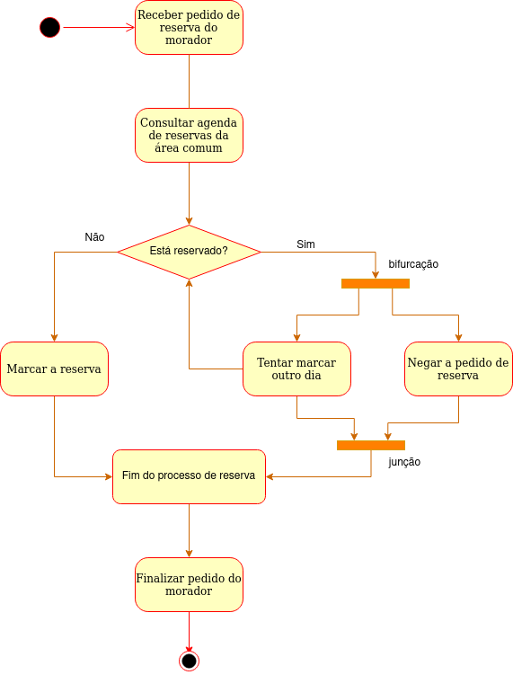
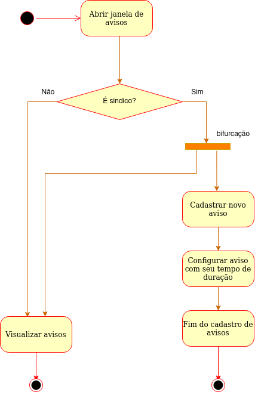

# Diagrama de Atividades

## 1. Introdução
É um tipo de diagramação UML. Mostra o comportamento do fluxo de objeto e controle com ênfase nas sequências e condições do fluxo[1]. 

## 2. Metodologia
O grupo fez uma reunião para inciar a montagem do diagrama de classes do projeto. A partir das dicussões dessa reunião e dos requisitos elicitados na entrega passada, criou-se dois diagramas de ativiades. Os Diagramas foram montados utilizando o site Drawio.

Foi realizado um único diagrama. Entretanto, o grupo achou um pouco confuso e achou melhor dividir em dois diagramas para melhorar o entendimento do fluxo das ativades. 

## 3. Artefatos Desenvolvidos

### 3.1 Diagrama Focado em Cadastro de Conta
Este diagrama mostra como dever ser o fluxo do cadastro de conta no SpotHood. 

<h6 align='center'>Figura 1. Cadastro de conta<h6/>
<h6 align='center' width="200" height="200">

<h6/>

### 3.2 Diagrama Focado em Reservas
Este diagrama mostra como deve ser o fluxo de quando é solicitada uma reserva de um espaço comum do condomínio cadastrado.

<h6 align='center'>Figura 2. Atividade de reservas v1.<h6/>
<h6 align='center' width="200" height="200">

<h6/>

<h6 align='center'>Figura 3. Atividade de reservas v2.<h6/>
<h6 align='center' width="200" height="200">

<h6/>

### 3.3 Diagrama Focado em Avisos 
Este diagrama mostra como deve ser o fluxo de quando é cadastrado ou consultado um aviso um [Aviso](Base/1.1.8.GlossarioLexico.md#aviso) onde apenas o síndico possui permissão de realizar um cadastro. 

<h6 align='center'>Figura 4. Atividade de reservas v2.<h6/>
<h6 align='center' width="200" height="200">

<h6/>

## 4. Fontes

Drawio: <https://app.diagrams.net/>

## 5. Referências

[1] Activity Diagrams. Disponível em <https://www.uml-diagrams.org/activity-diagrams.html> acesso em 1 de dezembro.

[2] VídeoAula - DSW - Modelagem - Diagrama de Atividades. Disponível em <https://unbbr-my.sharepoint.com/:v:/g/personal/mileneserrano_unb_br/Ed9k-OvMH7hMlNMj6CGVenMBSyeVrDBOdg84Czx_aHI9gw?e=ZzFF4A> acesso em 29 de novembro.

## 5. Histórico de versões
  
| Versão | Mensagem                   | Autor        | Revisor       | Data       |
|--------|----------------------------|--------------|---------------|------------|
| 1.0    | Criação do Documento       | Rafael e João | A Definir | 1/12/2022 |
| 1.1    | Detalhamento sobre o que foi feito neste arfato | Rafael | A Definir| 1/12/2022 |
| 1.2    | Ajuste do diagrama de ocorrências | Rafael e João | A Definir | 2/12/2022|
| 1.3    | Refatoração dos diagramas de atividades e inclusão de novos | Rafael e João | A Definir | 27/01/2023|