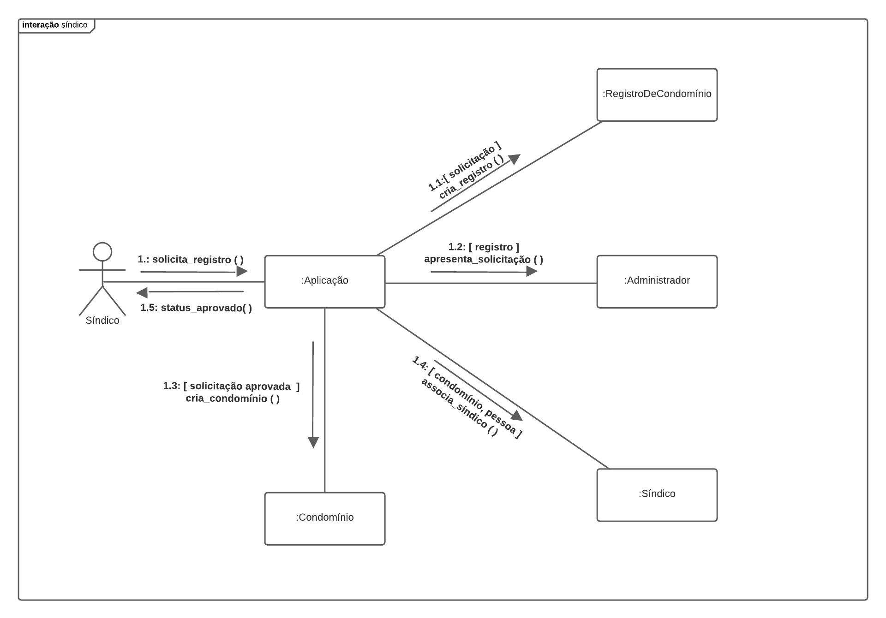
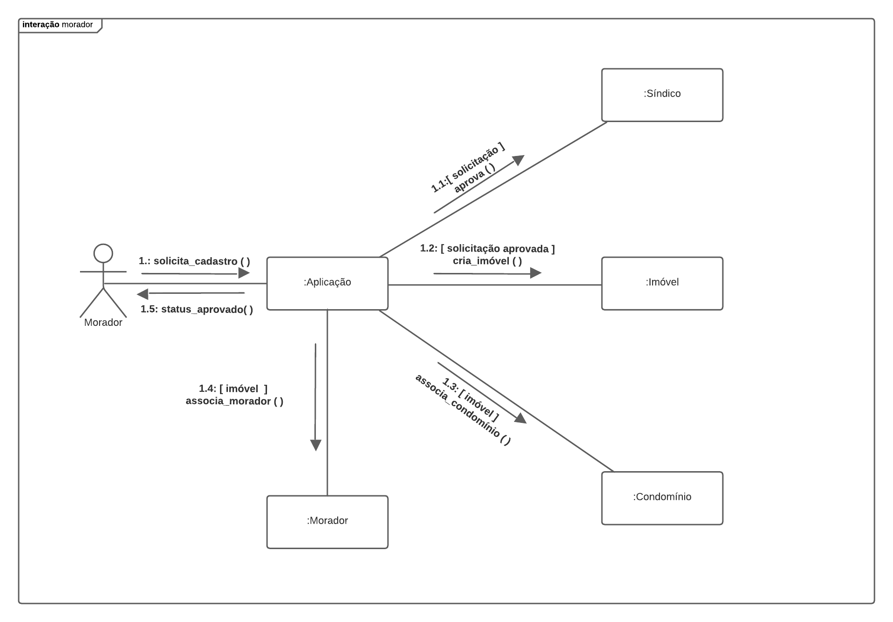

# Diagrama de Comunicação

## 1. Introdução

O Diagrama de Comunicação era conhecido como Diagrama de Colaboração até a versão 1.5 da UML, tendo seu nome modificado a partir da versão 2.0. Tem como função ajudar a ilustrar o funcionamento interno de um programa, representando-o como uma série de formas conectadas. Em um relance, você pode dizer quais objetos compõem o programa, como eles funcionam juntos e a ordem geral de operações.

## 2. Metodologia

Utilizando os casos de uso como base, foram escolhidas as principais interações do usuário dentro do sistema, tendo em foco como os elementos do diagrama estão vinculados e quais mensagens trocam entre si durante o processo.

## 3. Artefatos Desenvolvidos
### 3.1 Diagrama de Comunicação do Síndico
Diagrama que ilustra a interação de um usuário solicitando a criação do seu condomínio.
<h6 align='center'>Figura 1: Comunicação do Síndico v1.</h6>

<h6 align='center'>Fonte: Autoria do grupo</h6>

Houve a necessidade de alterar o diagrma de comunicação para adequar ao MVP. O novo diagrama ilustra as comunicações gerais que o síndico que é uma abstração de pessoa faz com a aplicação

<h6 align='center'>Figura 2: Comunicação do Síndico v2.</h6>

<h6 align='center'>Fonte: Autoria do grupo</h6>

### 3.2 Diagrama de Comunicação do Morador
Diagrama que ilustra a interação de um usuário solicitando a sua associação a um condomínio. O novo diagrama ilustra as comunicações gerais que o morador que é uma abstração de pessoa faz com a aplicação
<h6 align='center'>Figura 3: Comunicação do Morador v1.</h6>

<h6 align='center'>Fonte: Autoria do grupo</h6>

Houve a necessidade de alterar o diagrma de comunicação para adequar ao MVP
<h6 align='center'>Figura 4: Comunicação do Morador v2.</h6>

<h6 align='center'>Fonte: Autoria do grupo</h6>

## 4. Referências
[1] Diagrama de Comunicação UFMA. Disponível em <http://www.deinf.ufma.br/~geraldo/dob/10.Comunicacao.pdf> acesso em 01 de dezembro.
[2] Diagrama de Comunicação. Disponível em <Diagrama de Comunicação> acesso em 03 de dezembro.
[3] Diagrama de Comunicação (aula teórica). Disponível em <https://www.youtube.com/watch?v=6WUXsI0bbOs> acesso em 04 de dezembro.
## 5. Histórico de versões
  
| Versão | Mensagem                   | Autor        | Revisor       | Data       |
|--------|----------------------------|--------------|---------------|------------|
| 1.0    | Criação do Documento       | Daniel Oda | - | 1/12/2022 |
| 1.1    | Criação do Diagrama       | Daniel Oda | - | 4/12/2022 |
| 1.2    | Adição do Diagrama Morador       | Daniel Oda | Rafael| 4/12/2022 |
| 1.3    | Novas versões dos diagramas de comunicação | Rafael, João, Fernando | 29/01/2023 |