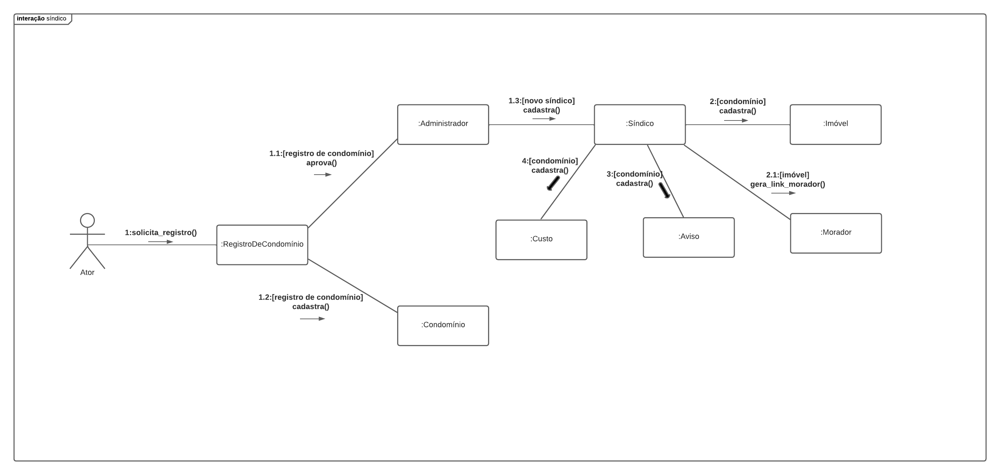

# Diagrama de Comunicação

## 1. Introdução
Um diagrama de comunicação ajuda a ilustrar o funcionamento interno de um programa, representando-o como uma série de formas conectadas. Em um relance, você pode dizer quais objetos compõem o programa, como eles funcionam juntos e a ordem geral de operações.

- Esclarecer o papel de cada objeto no programa;
- Diagramar cadeias lógicas complexas que envolvem vários objetos;
- Planejar novas funções e cenários para o programa.
- Demonstrar fluxos e subfluxos.
- Parametros
- Retorno dos metodos
- Clara e Limpa
- Algo só faz sentido se outra coisa tiver acontecido ou for checada
## 2. Metodologia

## 3. Artefatos Desenvolvidos

### 3.1 Diagrama

## 4. Fontes

## 5. Referências

## 5. Histórico de versões
  
| Versão | Mensagem                   | Autor        | Revisor       | Data       |
|--------|----------------------------|--------------|---------------|------------|
| 1.0    | Criação do Documento       | Daniel Oda | A Definir | 1/12/2022 |
| 1.1    | Criação do Diagrama       | Daniel Oda | A Definir | 4/12/2022 |