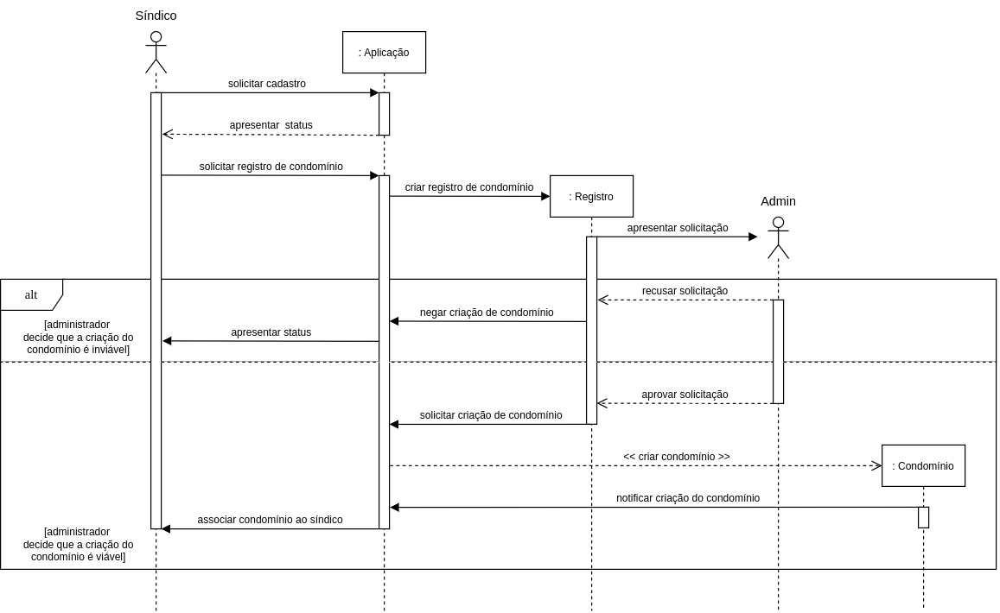
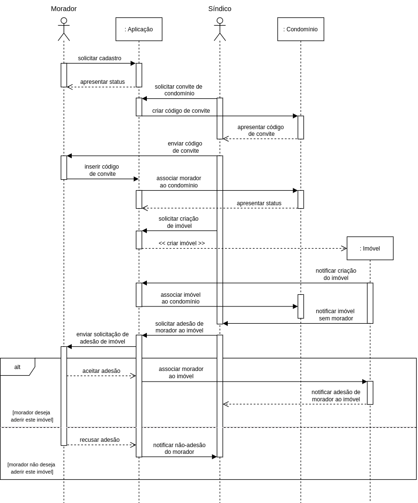

# Diagrama de Sequência

## 1. Introdução
O diagrama de sequência é um tipo de diagrama de interação que foca na troca de mensagens entre os objetos de uma aplicação.

As mensagens podem ser descritas em forma de frases ou métodos, o último caso usado para construir diagramas detalhados com a finalidade de auxiliar uma equipe experiente com informações mais específicas do funcionanmento do código a ser desenvolvido.

## 2. Metodologia
Para a confecção destes diagramas foi escolhida descrever as mensagens entre os objetos de maneira textual. A descrição das mensagens através dos métodos definidos no diagrama de classes foi ponderada por um tempo, mas com o intuito de manter a compreensão do diagrama mais adequada para qualquer leitor se optou usar a forma textual.

A quantidade de diagramas também foi um ponto de debate. Havia a necessidade de criar muitos diagramas, mas o diagrama de sequências é muito importante para ter apenas um, e mesmo um diagrama não seria suficiente para descrever os casos de uso mais pertinentes do projeto.

Por isso, foi optado criar pelo menos dois diagramas que abordassem os pontos de maior discussão e confusão do fluxo do software. Estes sendo a criação de condomínios e a alocação de imóveis. As atividades dentro da aplicação que se remetem ao gerenciamento do condomínio como avisos, regras e despesas estavam, em sua maioria, claras para os integrantes. No entanto, a parte inicial de como um usuário se integraria ao nosso sistema e como novos seriam alocados, foi um debate que persistiu por algumas reuniões e por isso os diagramas foram realizados com o intuito de sanar as dúvidas e manter claro o funcionamento dessa parte inicial do projeto.

Além disso, a forma que as mensagens interagem entre os objetos acabaram sendo padronizadas após a confecção dos diagramas, assim podemos manter a implementação de outras funcionalidades similares ao funcionamento destas já que muito do projeto gira em torno da criação e alocação de objetos uns aos outros.

A ferramenta utilizada para a criação dos diagramas foi a Draw.io, o conteúdo teórico derivado principalmente das aulas e de material online listado nas referências.

## 3. Artefatos Desenvolvidos
### 3.1 Diagrama de Criação de Condomínios
Este diagrama ilustra o fluxo de mensagens entre os objetos durante a criação de um condomínio e conta síndico.

### 3.1 Diagrama de Alocação de Moradores
Este diagrama ilustra o fluxo de mensagens entre os objetos durante a alocação de um morador a um novo imóvel.

## 4. Referências
[1] VídeoAula - Diagrama de Sequência (Visão Geral). Disponível em <https://youtu.be/UVkj3ed0ZuM> acesso em 02 de dezembro.

[2] VídeoAula - DSW - Modelagem - Diagrama de Sequência. Disponível em <https://unbbr-my.sharepoint.com/:v:/g/personal/mileneserrano_unb_br/EbRZaRfjkxdOuZXaSp_aEMkBP2Em7CtFZnt7_86DsBteBg?e=O9LfuJ> acesso em 02 de dezembro.

[3] UML Sequence Diagrams. Disponível em <https://www.uml-diagrams.org/sequence-diagrams.html> acesso em 03 de dezembro.

[4] Vídeo Online - How to Make a UML Sequence Diagram. Disponível em <https://www.youtube.com/watch?v=pCK6prSq8aw&ab_channel=LucidSoftware> acesso em 04 de dezembro.

[5] Vídeo Online - Criando diagrama de sequência | #10. Disponível em <https://www.youtube.com/watch?v=ypP6HQdDxYM&t=748s&ab_channel=EstudoNaWeb> acesso em 04 de dezembro.

[6] Vídeo Online - Exemplo de modelagem do diagrama de Sequência. Disponível em <https://www.youtube.com/watch?v=SsAzPzgrmsw&ab_channel=jonaspiccin> acesso em 04 de dezembro.

## 5. Histórico de versões
  
| Versão | Mensagem                   | Autor        | Revisor       | Data       |
|--------|----------------------------|--------------|---------------|------------|
| 1.0    | Criação do Documento       | Vinicius Oliveira | A Definir | 4/12/2022 |
| 1.1    | Adição dos Diagramas       | Vinicius Oliveira | A Definir | 4/12/2022 |
| 1.3    | Edição dos Tópicos e seus Conteúdos, Adição de Referências dos Diagramas       | Vinicius Oliveira | A Definir | 4/12/2022 |
