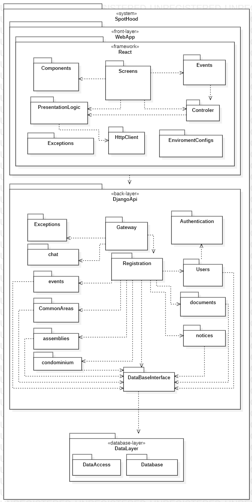
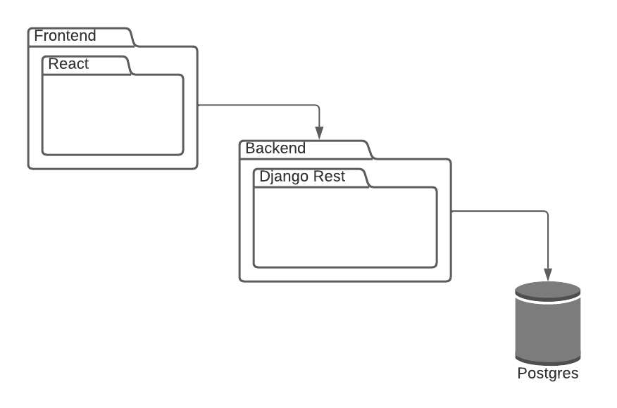
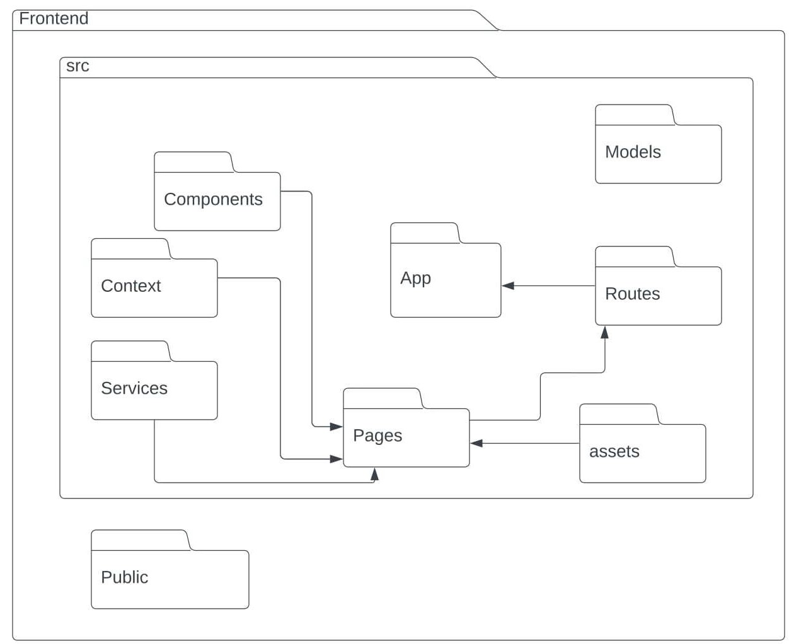
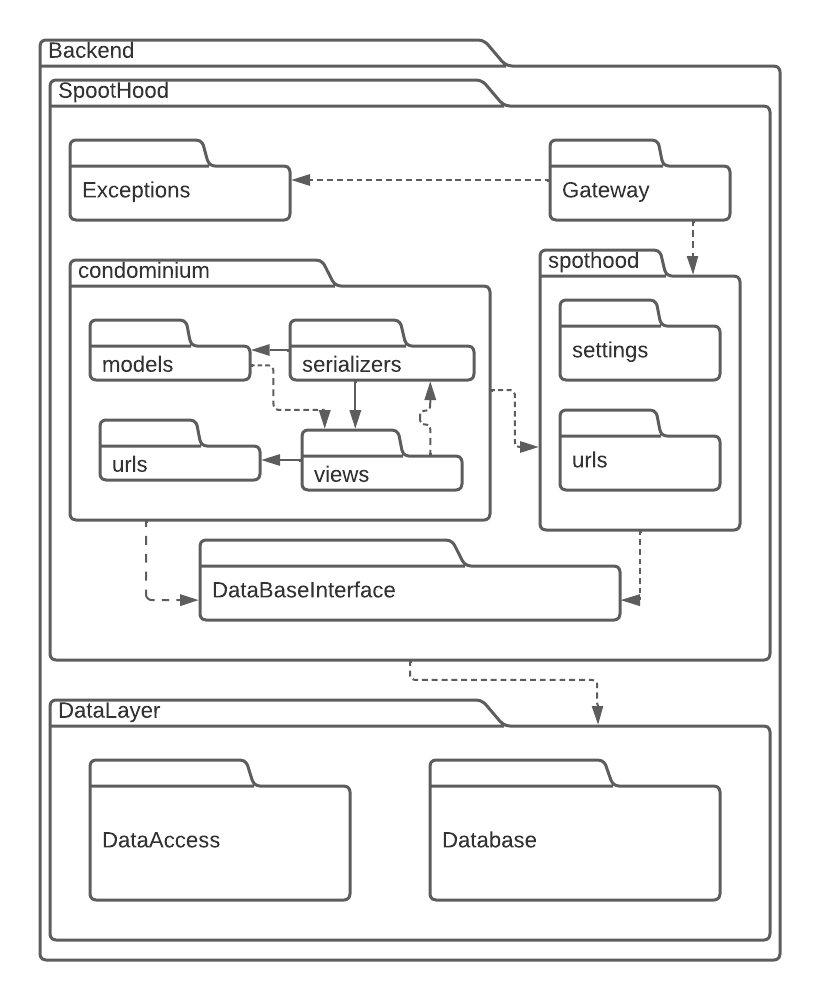

# Diagrama de Pacotes

## 1. Introdução

O Diagrama de Pacotes é um dos diagramas definidos pela UML. Ele tem o objetivo de descrever pedaços do sistema divididos em grupos lógicos expondo as detedências entre
eles. A definição de pacote é "Um mecanismo de propósito geral para organizar elementos semanticamente relacionados em grupos". Um pacote possui vários modelos de elementos,
que podem ser classes, objetos, estados, componentes ou até mesmo outros pacotes.

## 2. Metodologia

Para confecção do nosso Diagrama de Pacotes, foram feitas dinâmicas de discussão sobre o sistema da qual conseguimos chegar a concluões e gerar artefatos como stories boards
e fluxos do sistema em geral. Também houveram discussões técnicas para discutir sobre os possíveis frameworks e ferramentas que seram usadamas para a contrição do sistema.
Como, resultado, contruimos o Diagrama de Pacotes.

## 3. Diagrama

<h6 align='center'>Figura 1: Diagrama de Pacotes v1</h6>
<h6 align='center' width='50' heigth='50' src= >

</h6>
<h6 align='center'>Fonte: Autoria do grupo</h6>

  

<h6 align='center'>Figura 2.1: Diagrama de Pacotes Superfical v2</h6>
<h6 align='center' width='50' heigth='50' src= >

</h6>
<h6 align='center'>Fonte: Autoria do grupo</h6>

<h6 align='center'>Figura 2.2: Diagrama de Pacotes Frontend v2<h6>
<h6 align='center' width='50' heigth='50' src= >

</h6>
<h6 align='center'>Fonte: Autoria do grupo</h6>

<h6 align='center'>Figura 2.3: Diagrama de Pacotes Backend v2</h6>
<h6 align='center' width='50' heigth='50' src= >

</h6>
<h6 align='center'>Fonte: Autoria do grupo</h6>

## 4. Referências
> UML Package Diagrams Overview. Disponível em: <https://www.uml-diagrams.org/package-diagrams-overview.html>, acessado em 03/12/2022.

## 5. Histórico de versões

| Versão | Mensagem                                                                 | Autor           | Data       |
|--------|--------------------------------------------------------------------------|-----------------|------------|
| 1.0    | Criação do Documento                                                     | Fernando Vargas | 03/12/2022 |
| 1.1    | Criação da segunda versão do diagrama de pacotes: geral e backend        | Fernando e Levi | 30/01/2023 |
| 1.2    | Criação da segunda versão do diagrama de pacotes: frontend               | Fernando e Levi | 30/01/2023 |
