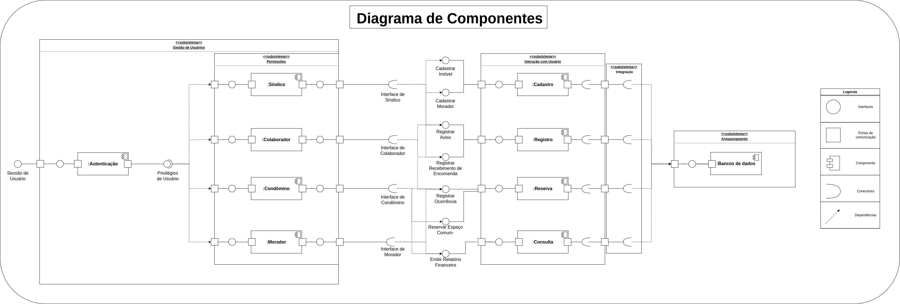
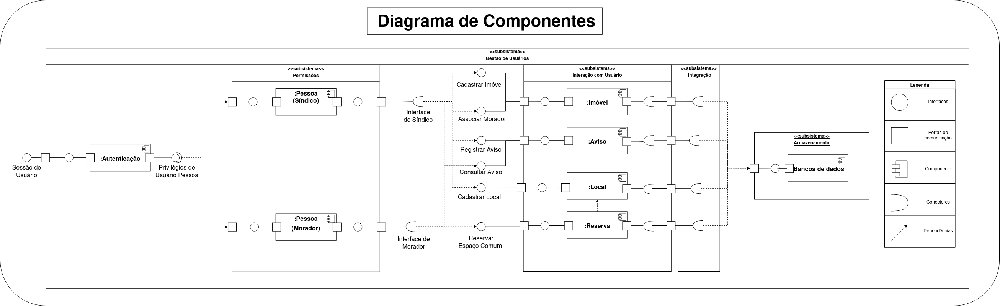

# Diagrama de Componentes
## 1. Introdução  
O diagrama de componentes tem como objetivo mostrar o relacionamento entre diferentes componentes de um sistema, ele identifica os diferentes componentes para que todo o sistema funcione corretamente. O mais comum é usar o diagrama de componentes para podermos agrupar classes com base em um objetivo comum, para que dessa forma o desenvolvedor e outras pessoas envolvidas possam analisar o projeto de desenvolvimento de software de forma general.[1]

## 2. Metodologia

A partir do desenvolvimento do [diagrama de classes](/Modelagem/2.1.1.diagramaDeClasses?id=_3-diagrama) v1 pelo grupo, iniciamos o desenvolvimento do diagrama de componentes na Figura 1, que nos permitiu ter uma visão de como cada componente criado irá integrar o projeto.

Ao final do projeto, houve a necessidade de fazer uma nova versão do diagrama de componentes, representado na Figura 2, para entrar em acordo com o [diagrama de classes](/Modelagem/2.1.1.diagramaDeClasses?id=_3-diagrama) que também ganhou uma nova versão. Isso ocorreu devido a uma necessidade de redução de escopo para o desenvolvimento de um MVP.

## 3. Artefato Desenvolvido
Abaixo seguem as versões do artefato de diagrama de componentes produzido:

<h6 align='center'>Figura 1: Diagrama de Componentes v1.</h6>

<h6 align='center'>Autor: SpotHood Team</h6>

<h6 align='center'>Figura 2: Diagrama de Componentes v2.</h6>

<h6 align='center'>Autor: SpotHood Team</h6>

> Para mais detalhes, confira o artefato diretamente em nosso repositório: [link para a figura](https://github.com/UnBArqDsw2022-2/2022.2_G3_SpotHood/tree/main/docs/assets/diagrama_de_componentes/diagrama_de_componentes.png)

## 4. Referências
[1] Diagrama de Componentes UML. Disponível em <https://www.lucidchart.com/pages/pt/diagrama-de-componentes-uml> acesso em 4 de dezembro.

<!-- [2] VídeoAula - DSW - Modelagem - Componentes. Disponível em <https://unbbr-my.sharepoint.com/personal/mileneserrano_unb_br/_layouts/15/stream.aspx?id=%2Fpersonal%2Fmileneserrano_unb_br%2FDocuments%2FArqDSW%20-%20VídeosOriginais%2F05h%20-%20VideoAula%20-%20DSW-Modelagem%20-%20Componentes%2Emp4&ga=1> acesso em 4 de dezembro. -->

## 5. Histórico de versões
  
| Versão | Mensagem | Autor  | Revisor       | Data       |
|--------|----------|--------|---------------|------------|
| 1.0    | Criação do Documento  | Mariana Rio e Paulo Gontijo | Rafael    | 04/12/2022 |
| 1.1    | Nova versão do diagrama de componentes | Rafael, Paulo e Victor | A Definir | 29/01/2023|
