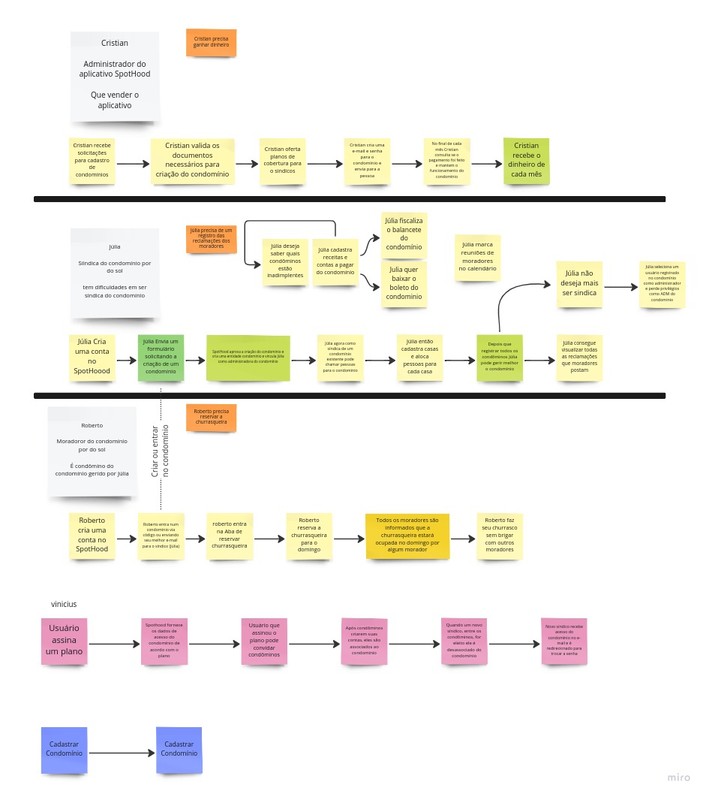
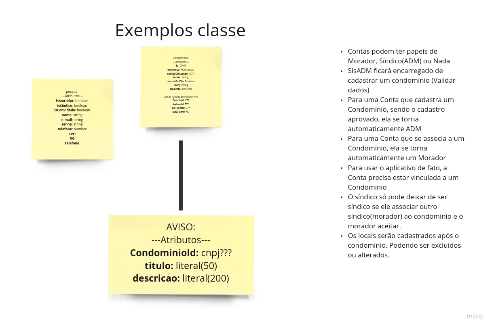
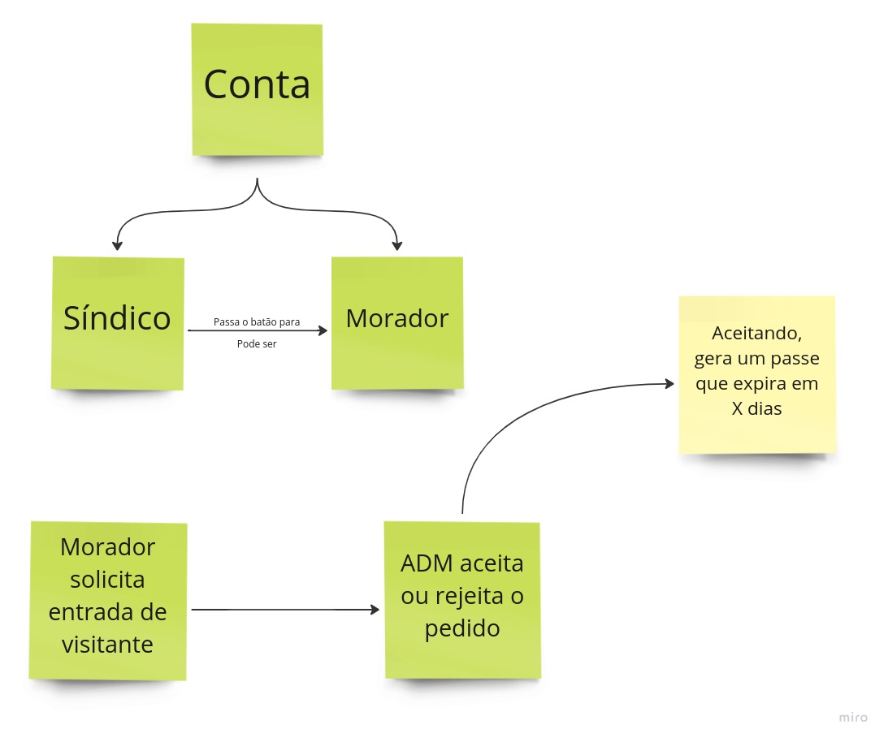
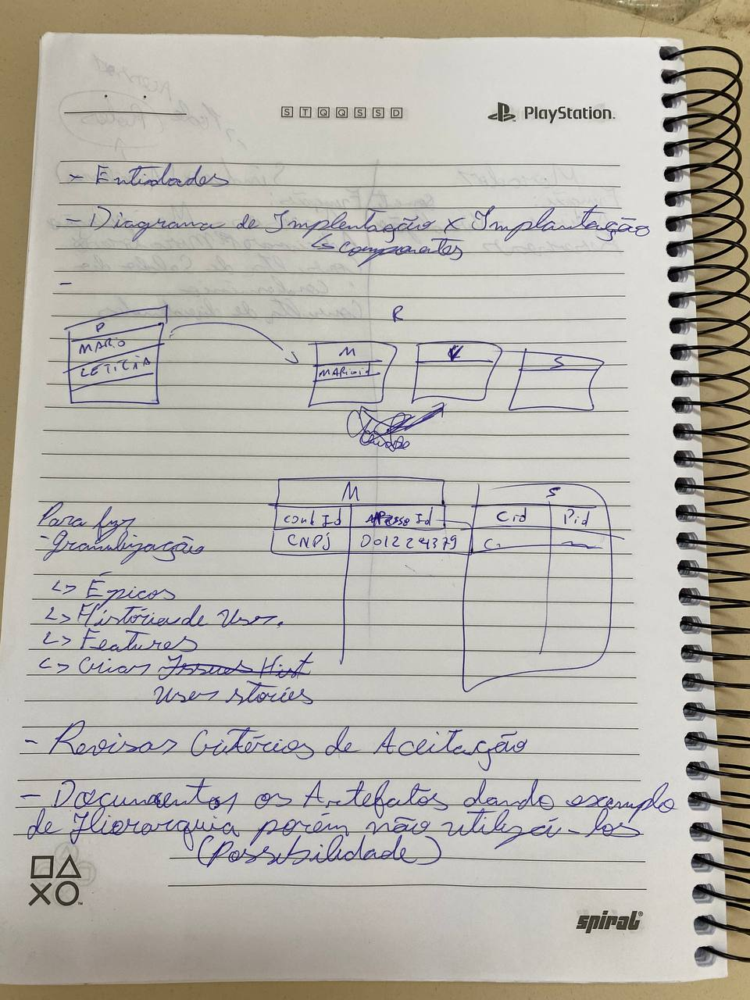
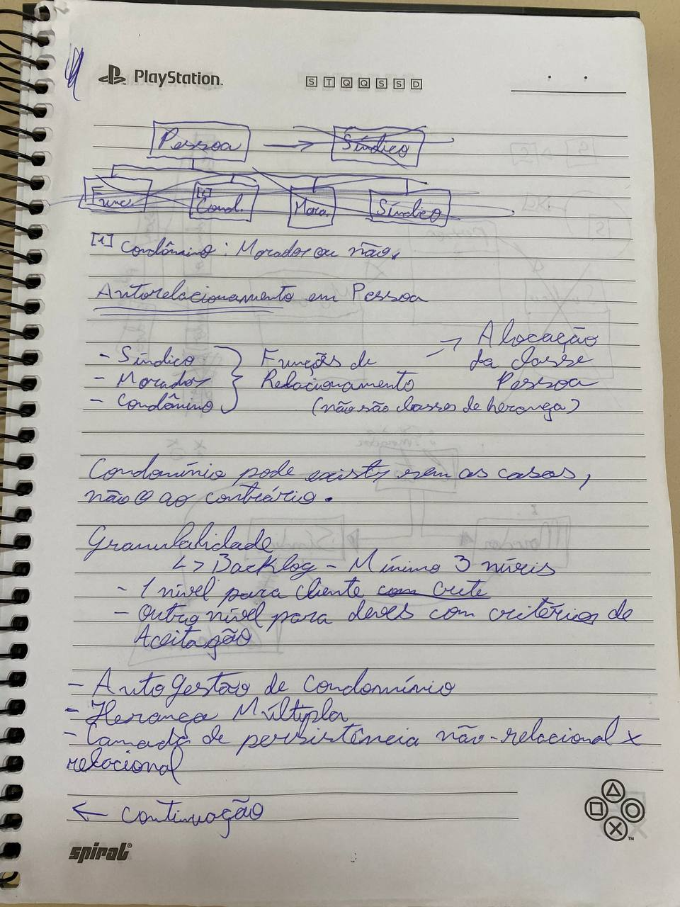
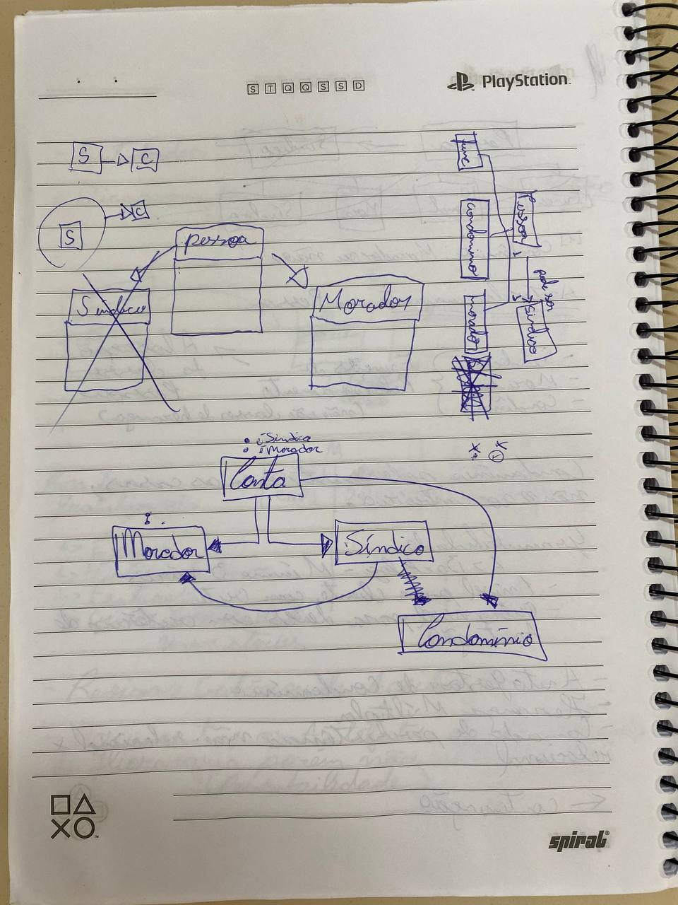
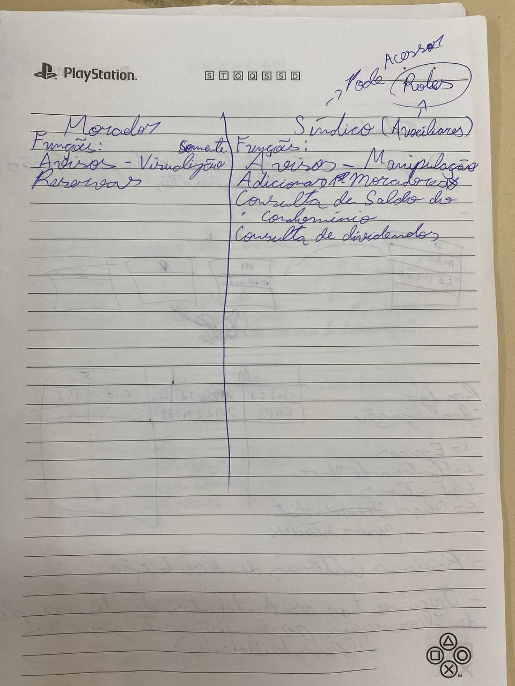

# Documentos Extras

## 1. Introdução
É um conjunto de documentos que ajudou o grupo a entender o problema. Os tópicos de 2 a 4 foram desenvolvidos no miro pelo link do [Miro](https://miro.com/app/board/uXjVP92iLBQ=/?share_link_id=132277493571). O Tópico 5 foi desenvolvido em sala de aula.

## 2. Rascunho de Fluxo de Uso
O Grupo se reuniu no dia 1 de dezembro as 21:00 e criou um documento compartilhado no Miro para registrar as idéias e entendimentos a partir de histórias de usuários

## 3. Rascunho de Classes
A partir do rascunho de Fluxo de Uso, o grupo fez esse primeiro esboço das possíveis classes do projeto.

## 4. Rascunho de Relacionamento de Classes
Com as possíveis classes em mãos, o grupo tentou pensar em como elas se relacionariam.

## 5. Brainstorm
O grupo esteve presente na aula de dúvidas do dia 2 de dezembro e, durante a aula, anotou em um caderno ideias que ajudaram a esclarecer dúvidas acerca do projeto e dos artefatos a serem entregues.

## 4. Versionamento

| Versão | Mensagem                   | Autor        | Data       |
|--------|----------------------------|--------------|------------|
| 1.0    | Criação do Documento      | Rafael | 2/12/2022 |
| 1.1    | Adição de novos documento desenvolvido pelo grupo e refatoração do versionamento| Rafael | 3/12/2022 |