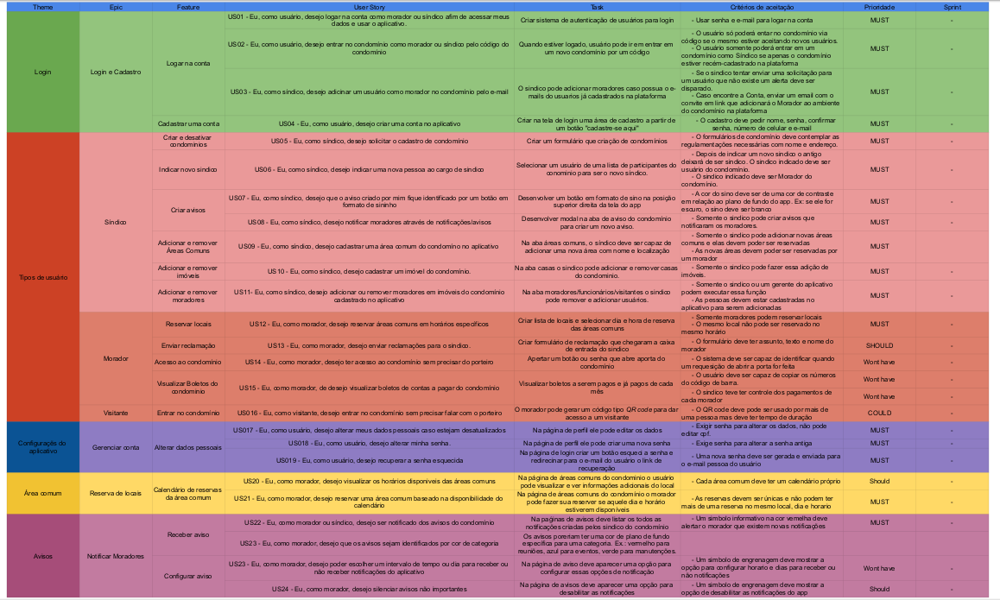

# Backlog do Produto
## 1. Introdução

### 1.1 O que é o Backlog
O *Product Backlog* é uma lista de itens a serem implementados dentro do escopo de desenvolvimento de software, em que os 
itens são priorizados de acordo com o valor que cada funcionalidade agrega para o cliente. O backlog é atualizado e sofre 
alterações durante o processo de desenvolvimento, em conformidade com o andamento do projeto. Dentro de uma abordagem Ágil, 
os itens do backlog são desenvolvidos ao longo de Sprints, que englobam determinada quantidade de itens. Já
em um contexto tradicional, como Kanban, o desenvolvimento acontece de forma linear, com o foco na execução completa da tarefa
sem quebrar o fluxo de trabalho.

### 1.2 O que é a priorização MoSCoW

Definir o que é prioridade em um software é importante para as metodologias ágeis e é
algo que as pessoas assumem que 'sempre' foi feito. Entretanto qual é o dano
que pode acontecer se os requisitos NÃO forem priorizados ?

O livro [PMBOK](https://www.pmi.org/pmbok-guide-standards/foundational/pmbok?sc_camp=8A8BABF66EF9499DB5CCD1C1044CB211)
elicita a triplice de restrições que devem ser consideradas para gerenciar projetos, 
são elas: Tempo, Escopo, Custo. Quando os requisitos não são priorizados, ou são mal
priorizados, a consequência é ter um escopo grande e com requisitos que não são
capazes de atender ao negócio. Como consequência o tempo e custo para produção do
software serão maiores e o foco em qual é a necessidade do usuário também será 
prejudicado.

A priorização dos requisitos é algo que se destaca em projetos de metodologias ágeis,
já que esta ação assume que nem todos os requisitos têm a mesma capacidade de gerar
valor para o negócio que o software está inserido.
Se um requisito possui baixa priorização isto não significa que ele é inútil,
mas que para o atual momento de maturidade do software ele não é capaz de gerar
tanto valor quanto os requisitos mais bem priorizados.

O métodos MoSCoW é usado para priorizar os requisitos de um projetos. A Técnica foi
criada por Dai Clegg, enquanto ele desenvolvia seus trabalhos na Oracle, nos anos 90. A
simplicidade do método permite que os membros do time e stakeholders entrem em acordo,
de maneira fácil, sobre quais requisitos são mais importantes. 

As classificações do MoSCoW são: Must, Should, Could, Wouldn’t. Must have implica que
a funcionalidade é indispensável para entrega; Should have diz que o requisito é 
importante, mas não é essencial para a entrega; Could have significa que o requisito
é desejável, mas não é essencial do ponto de vista do negócio; Wouldn't have que é
a funcionalidade com prioridade mais baixa e menor retorno do investimento no momento
atual.

### 1.3 Épicos, Histórias de usuários e Tarefa

A granularização dos requisitos seguirá o seguinte padrão:
-  Épico: É uma história de usuário que ainda não foi detalhada, é muito grande ou ainda
possui muita incerteza e portanto não pode ser transformada em incremento do produto. 
- História de usuário: é um formato sucinto para escrita dos requisitos necessários para
a construção de um produto. 
- Tarefas: são itens técnicos necessários para que uma História de Usuário se transforme
em incremento do produto. 

## 2. Requisitos Funcionais
Abaixo segue a tabela de requisitos funcionais elicitados:

| Numero |              Nome               |                                                       Descrição                                                        |                                   Origem                                    | Prioridade | Granularidade |
|:------:|:-------------------------------:|:----------------------------------------------------------------------------------------------------------------------:|:---------------------------------------------------------------------------:|:----------:| :-----: |
|  RF01  |      Cadastrar condomínio       |                             Cadastro de um condomínio no site e suas regras de convivência                             |  [Brainstorm](Base/brainstorm.md), [Mapa Mental](Base/1.1.3.MapaMental.md)  | Must  | Tarefa|
|  RF02  |      Cadastrar funcionário      |                     Cadastro de um ou mais funcionários com diferentes papéis dentro do condomínio                     | [Brainstorm](Base/brainstorm.md), [Rich Picture](Base/1.1.7.RichPicture.md) | Should  | Tarefa|
|  RF03  |        Cadastrar síndico        |                                    Cadastro de um síndico designado a um condomínio                                    | [Brainstorm](Base/brainstorm.md), [Rich Picture](Base/1.1.7.RichPicture.md) | Must  | Tarefa|
|  RF04  |       Cadastrar condômino       |                 Cadastro de um condômino, proprietário de uma ou mais unidades dentro de um condomínio                 |  [Brainstorm](Base/brainstorm.md), [Mapa Mental](Base/1.1.3.MapaMental.md)  | Must  | Tarefa|
|  RF05  |        Cadastrar morador        |                          Cadastro de um ou mais moradores de uma unidade dentro do condomínio                          | [Brainstorm](Base/brainstorm.md), [Rich Picture](Base/1.1.7.RichPicture.md) | Should  | Tarefa|
|  RF06  |       Cadastrar vistante        |                                Cadastro de um vistante de uma ou mais unidades no site                                 | [Brainstorm](Base/brainstorm.md), [Rich Picture](Base/1.1.7.RichPicture.md) |  Wouldn’t  | Tarefa|
|  RF07  | Cadastrar veículo de condômino  |                          Cadastro de um veículo vinculado a uma vaga de garagem do condomínio                          |  [Brainstorm](Base/brainstorm.md), [Mapa Mental](Base/1.1.3.MapaMental.md)  | Could  | Tarefa|
|  RF08  |        Cadastrar evento         |     Cadastro, pelo síndico, de eventos (reunião, festas, aulões, etc) que ocorrerão em certas datas no condomínio      | [Brainstorm](Base/brainstorm.md), [Rich Picture](Base/1.1.7.RichPicture.md) | Must  | História de usuário|
|  RF10  |        Cadastrar locais         |   Cadastro, pelo síndico, de locais (quadra de esportes, academia, piscina, churrasqueira, etc) dentro do condomínio   | [Brainstorm](Base/brainstorm.md), [Rich Picture](Base/1.1.7.RichPicture.md) | Must  | História de usuário|
|  RF11  |        Cadastrar avisos         |                                      Cadastro, pelo síndico, de eventuais avisos                                       | [Brainstorm](Base/brainstorm.md), [Rich Picture](Base/1.1.7.RichPicture.md) | Must  | História de usuário|
|  RF12  | Emissão de relatório financeiro | A cada mês, o síndico emite um relatório de gastos e de receita do condomínio para visualização de todos os condôminos |  [Brainstorm](Base/brainstorm.md), [Mapa Mental](Base/1.1.3.MapaMental.md)  | Must  | História de usuário|
|  RF13  |       Cadastro de votação       |                  O sistema deve ser capaz de realizar votações internas de assembléias condomininais                   |  [Brainstorm](Base/brainstorm.md), [Mapa Mental](Base/1.1.3.MapaMental.md)  | Could  | História de usuário|
|  RF14  |       Cadastro de boletos       |                 O sistema deve ser capaz de cadastrar boletos para o pagamento das taxas de condomínio                 |  [Brainstorm](Base/brainstorm.md), [Mapa Mental](Base/1.1.3.MapaMental.md)  | Wouldn't  | História de usuário|
|  RF15  |     Cadastro de ocorrências     |                         O sistema deve ser capaz de cadastrar eventuais ocorrências que surjam                         |  [Brainstorm](Base/brainstorm.md), [Mapa Mental](Base/1.1.3.MapaMental.md)  | Should  | História de usuário|
|  RF16  |      Cadastro de reservas       |                            O sistema deve ser capaz de cadastrar reservas de espaços comuns                            |  [Brainstorm](Base/brainstorm.md), [Mapa Mental](Base/1.1.3.MapaMental.md)  | Should | História de usuário|
|  RF17  |      Cadastro de finanças       |                 O sistema deve ser capaz de cadastrar operações financeiras corriqueiras do condomínio                 |  [Brainstorm](Base/brainstorm.md), [Mapa Mental](Base/1.1.3.MapaMental.md)  | Must  | História de usuário|

<h6 align='center'>Tabela 1: Requisitos Funcionais<h6/>

## 3. Requisitos Não Funcionais
Abaixo segue a tabela de requisitos não funcionais elicitados:

| Numero |        Nome        |                                        Descrição                                        |              Origem              | Prioridade |
|:------:|:------------------:|:---------------------------------------------------------------------------------------:|:--------------------------------:|:----------:|
| RNF01  | Interopelabilidade |                   A aplicação deve ser executado em qualquer browser                    | [Brainstorm](Base/brainstorm.md) | Should  |
| RNF02  |    Resiliência     |          O website deve ser capaz de receber múltiplas requisições simultâneas          | [Brainstorm](Base/brainstorm.md) | Should  |
| RNF03  |    Resiliência     |                    O website deve estar disponível 24 horas por dia                     | [Brainstorm](Base/brainstorm.md) | Could  |
| RNF04  |    Resiliência     | O website deve ser capaz realizar manutenções sem prejudicar o funcionamento do sistema | [Brainstorm](Base/brainstorm.md) | Could  |

<h6 align='center'>Tabela 2: Requisitos Não Funcionais<h6/>

## 4. Granularização do Backlog

Chegamos no 7º nível de granularidade e elaboramos ele com base no nosso backlog de produto e diagrama de classes.

O Backlog granularizado ajuda a entender, criar e rastrear tarefas durante a etapa de desenvolvimento do projeto. Uma vez que podemos elaborar as issues nas próprias task do backlog granulizado. A medida que as Sprints forem passando iremos atualizar o documento depois de designar cada feature a sua respectiva sprint.

<iframe src="https://docs.google.com/spreadsheets/d/e/2PACX-1vTSZhv1m4Ih1sXUryDxPIMs2MQh_P3PSv6jrn41WzLpP92u6IjSSYug9vc4sJnECTXwGsizMj8PTlmB/pubhtml?widget=true&amp;headers=false"  height="600" ></iframe>

OBS: Se o google sheets não carregar acesse o artefato original clicando [aqui](https://docs.google.com/spreadsheets/d/1_OBolqpIk5YboS5gEYOqj_sh9MTOYxlpH2QsI-co5O0/edit?usp=sharing)

## 5. Histórico de versões

| Versão |    Data    |                       Modificação                        |                                                             Autor                                                              |
|:------:|:----------:|:--------------------------------------------------------:|:------------------------------------------------------------------------------------------------------------------------------:|
|  1.0   | 16/11/2022 | Criação do documento e tópico de 'requisitos elicitados' | Cristian Furtado, Paulo Gontijo, João Henrique, Fernando Vargas, Rafael Berto, Victor Yukio, Vinícius Oliveira, Rodrigo Santos |
|  1.1   | 17/11/2022 |        Adicionando rastreabilidade aos requisitos        |                                                      Rafael Berto Pereira                                                      |
|  1.2   | 17/11/2022 |               Complementação de requisitos               |                                                         Paulo Gontijo                                                          |
|  2.0   | 29/11/2022 |               Priorização dos requisitos           |    Paulo Gontijo, João Henrique, Cristian Furtado, Victor Yukio, Daniel Oda, Rafael Berto, Fernando Vargas, Rodrigo Santos    |
|  2.1   | 29/11/2022 |               Explicação o que é MoSCoW           |    João Henrique, Victor Yukio, Rafael Berto |
|  2.2   | 29/11/2022 |               Explicação o que é granularidade           |    João Henrique, Victor Yukio, Rafael Berto |
|  2.3   | 29/11/2022 |          Granularização dos requisitos           |    João Henrique, Victor Yukio, Rafael Berto |
| 2.4 | 04/12/2022 | Granularização do Backlog | João Henrique, Victor Yukio, Rafael Berto
| 2. 5| 04/01/2023 | Correção da Granularização do Backlog | Rafael Berto|