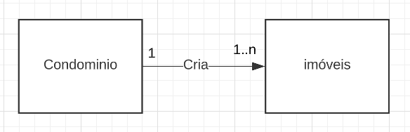
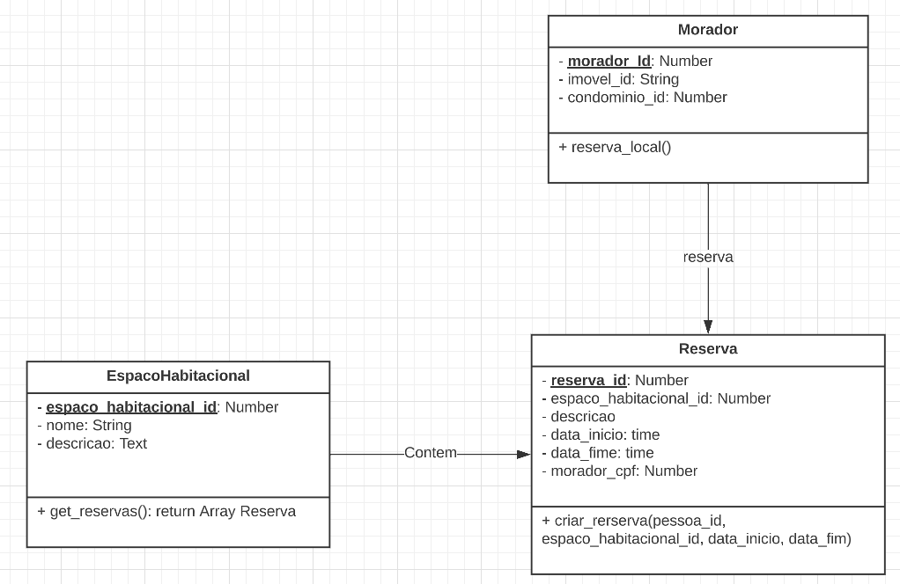

# Módulo Padrões de Projeto GRASPs

## 1. Introdução
GRASP é uma sigla do inglês para General Responsibility Assignment Software
Patterns. Ele serve, em um projeto orientado a objetos(OO), para indicar as obrigações da classe em ralação ao seu comportamento. Desse modo, irão descrever príncipios fundamentais de OO atribuindo responsabilidades indicadas por padrões.O GRASP é responsavel por mostrar como o sistema será projetado.[1]

## 2. Exemplos

### 2.1 GRASP Criador
Responsável por criar uma nova instância de uma classe. Ou seja, o criador vai dar um caminho para a atribuição relacionada à criação de um objeto.[1]

### 2.1.1 Implementação
No desenvolvimento da nossa aplicação utilizamos o padrão de projeto Criador para gerenciar a criação de imóveis pelo condomínio.

O problema encontrado em acessar os dados e a descrição do imóvel é resolvido associando dos imóveis durante a criação do condomínio. Assim, Garantimos que todos os imóveis estajam dentro do domínio do condomínio sem deixar imóveis deslocados.

### 2.2 GRASP Alta Coesão
Controla a complexidade da classe. Tem o objetivo de melhorar o entendimento da classe falicitar a reutilização da classe. Consequentemente irá possuir um número pequeno de métodos.[2]

Esse tipo de padrão de projeto é muito utilizado junto ao Controlador para dar suporte para ao um baixo aclopamento.[3]

### 2.3 GRASP Controlador
Além da camada de Interface do Usuário, o controlador é o primeiro objeto desenvolvido. Ele será responsável por receber e tratar uma evento de operação do sistema.[1][2]

### 2.4 GRASP Polimorfismo
Quanto nos deparamos com classes semelhantes, mas que possuem métodos distintos. O uso do polimorfismo é uma ótima prática. Dessa forma, a variação dos tipos comportamentais é atribuida ao tipo da variação.

### 2.5 Especialização
É um padrão que atribui a responsabilidade de uma determinada função a classe "expert", ou seja, a classe que possui as informações necessárias para conseguir realizar aquela ação.

Em nosso modelo, utlizamos o Grasp de especilização na funcionalidade de reserva do espaço habitacional pelo modarador do condominio. a classe reserva detêm as informações de qual espaço habitacional será reservado e do morador que realizou a reserva.

## Referências
[1] M. Cecilia, C. Baranauskas. GRASP: Designing Objetos com Responsabilidades. Disponível em <https://www.ic.unicamp.br/~ariadne/mc436/1s2017/Lar16GRASP.pdf> acesso em 04/01/2023.

[2] Serrano Milene. Arquitetura e Desenho de Software AULA - GRASP – PARTE I. Disponível em <https://aprender3.unb.br/pluginfile.php/2277128/mod_label/intro/Arquitetura%20e%20Desenho%20de%20Software%20-%20Aula%20GRASP%20BASE%20Parte%20I%20-%20Profa.%20Milene.pdf> acesso em 04/01/2023.

[3] Larman, Craig (2005) [2004]. Applying UML and Patterns – An Introduction to Object-Oriented Analysis and Design and Iterative Development 3rd ed. Disponível em: https://pt.wikipedia.org/wiki/GRASP_(padr%C3%A3o_orientado_a_objetos) acesso em 05/01/2023.

## Versionamento
| Versão | Mensagem              | Autor        | Data       |
|--------|-----------------------|--------------|------------|
| 1.0    | Criação do Documento  | Rafael Pereira| 05/01/2023 |
| 1.1    | introdução, exemplos, referência | Rafael Pereira  | 05/01/2023|
| 1.2    | Adicionar implementação de GRASP e outros exemplos | Victor Yukio, Rodrigo, Cristian | 05/1/2023 |