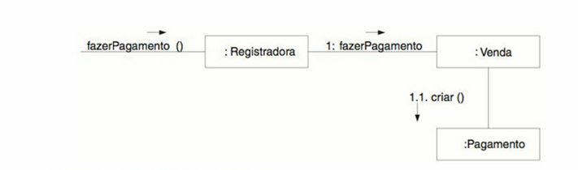

# Módulo Padrões de Projeto GRASPs

## 1. Introdução
GRASP é uma sigla do inglês para General Responsibility Assignment Software
Patterns. Ele serve, em um projeto orientado a objetos(OO), para indicar as obrigações da classe em ralação ao seu comportamento. Desse modo, irão descrever príncipios fundamentais de OO atribuindo responsabilidades indicadas por padrões.O GRASP é responsavel por mostrar como o sistema será projetado. Segue abaixo três exemplos de GRASPs[1]

## 2. Exemplos

### 2.1. GRASP Criador
Responsável por criar uma nova instância de uma classe. Ou seja, o criador vai dar um caminho para a atribuição relacionada à criação de um objeto.[1]

### 2.1.1. Implementação
No desenvolvimento da nossa aplicação utilizamos o padrão de projeto Criador para gerenciar a criação de imóveis pelo condomínio.

O problema encontrado em acessar os dados e a descrição do imóvel é resolvido associando dos imóveis durante a criação do condomínio. Assim, Garantimos que todos os imóveis estajam dentro do domínio do condomínio sem deixar imóveis deslocados.

<h6 align='center'>Figura 1: GRASP criador da aplicação<h6/>

 

<h6 align='center'>Fonte: Autoria do grupo<h6/>

### 2.2. GRASP Baixo Acoplamento
Define uma "medida de quão fortemente um elemento está conectado a, tem conhecimento de, ou depende de outros elementos"([3], p. 307). Lógicamente, um elemento com acoplamento fraco não é dependente de muitos outros demais elementos(classes, subsistemas, sistemas, entre outros).[3]

### 2.2.1 Exemplo Didático
Larman defende que "O nível de acoplamento em si não pode ser considerado isolado de outros princípios, tais como Especialista e Coesão Alta. No entanto, é um fator a considerar no aperfeiçoamento de um projeto"([3], p. 308).

<h6 align='center'>Figura 2: Recomendação de baixo acoplamento do Larman<h6/>

 

<h6 align='center'>Fonte: [3], p. 308<h6/>

### 2.3. GRASP Especialista
É um padrão que atribui a responsabilidade de uma determinada função a classe "expert", ou seja, a classe que possui as informações necessárias para conseguir realizar aquela ação.

### 2.3.1. Implementação
Em nosso modelo, utlizamos o Grasp de especilização na funcionalidade de reserva do espaço habitacional pelo modarador do condominio. a classe reserva detêm as informações de qual espaço habitacional será reservado e do morador que realizou a reserva.

<h6 align='center'>Figura 3: GRASP Especialista da aplicação<h6/>

<h6 align='center'>Fonte: Autoria do grupo<h6/>

## 3. Referências
[1] M. Cecilia, C. Baranauskas. GRASP: Designing Objetos com Responsabilidades. Disponível em <https://www.ic.unicamp.br/~ariadne/mc436/1s2017/Lar16GRASP.pdf> acesso em 04/01/2023.

[2] Serrano Milene. Arquitetura e Desenho de Software AULA - GRASP – PARTE I. Disponível em <https://aprender3.unb.br/pluginfile.php/2277128/mod_label/intro/Arquitetura%20e%20Desenho%20de%20Software%20-%20Aula%20GRASP%20BASE%20Parte%20I%20-%20Profa.%20Milene.pdf> acesso em 04/01/2023.

[3] LARMAN, Craig. Utilizando UML e Padrões. E-book. ISBN 9788577800476. Disponível em: https://integrada.minhabiblioteca.com.br/#/books/9788577800476/. Acesso em: 06 jan. 2023.

## Versionamento
| Versão | Mensagem              | Autor        | Data       |
|--------|-----------------------|--------------|------------|
| 1.0    | Criação do Documento  | Rafael Pereira| 05/01/2023 |
| 1.1    | introdução, exemplos, referência | Rafael Pereira  | 05/01/2023|
| 1.2    | Adicionar implementação de GRASP e outros exemplos | Victor Yukio, Rodrigo, Cristian | 05/01/2023 |
| 1.3    | Ajuste de imagens, adição de exemplo didatico, remoção de grasps sem exemplo | Rafael | 06/01/2023 |