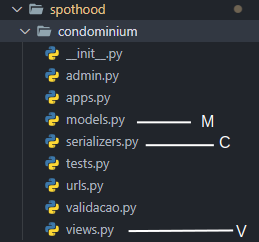

# Módulo Padrões de Projeto Extras

## 1. MVC
MVC ou Model-View-Controller, representado na figura 1, é um padrão de projeto que prevê uma arquitetura em três camadas sendo elas Modelo(Model), Visão(View) e Controlador(Controller). A Camada de **Modelo** fica responsável pelas regra de negócio e dados empresariais do sistema, assim, aproximando-se de um processo do mundo real.  Já a camada de **Visão** orienta como o modelo deve ser apresentado. A camada **Controlador** vai traduzir as interações entre as duas camadas anteriores.[3]

<h6 align='center'>Figura 1: Representação do MVC</h6>
<h6 align='center'>

</h6>
<h6 align='center'>Fonte: Devmedia, [1]</h6>

No Django Rest Framework, a Model é a camada de dados que representa as entidades da aplicação, como usuários, produtos, pedidos, etc. Ela é definida utilizando o ORM (Object-Relational Mapping) do Django, que permite que as entidades sejam representadas como classes Python e que as operações de banco de dados sejam realizadas através de métodos dessas classes.

O Controller é representado pelos ViewSets e pelos serializers. Um ViewSet é uma classe que controla as operações CRUD (Create, Retrieve, Update, Delete) de uma entidade. Ele define quais ações devem ser executadas para cada tipo de requisição HTTP (GET, POST, PUT, DELETE, etc.). Serializers são utilizados para converter os dados entre o formato de requisição ou resposta (geralmente JSON) e o formato de objeto Python. Eles também são responsáveis por validar os dados antes de salvá-los no banco de dados ou retorná-los na resposta.

além disso, a View é representada por classes chamadas viewsets e views. Um ViewSet é uma classe que define as ações que devem ser executadas para cada tipo de requisição HTTP (GET, POST, PUT, DELETE, etc.), enquanto que views são funções ou classes que tratam uma requisição HTTP específica e retorna uma resposta.

### 1.1 Aplicação no projeto
No nosso projeto o padrão MVC foi aplicado no backend onde, na figura 2, M representa a *model*, C representa a *controller* e V representa a *view*

<h6 align='center'>Figura 2: Representação no projeto<h6/>
<h6 align='center'>

<h6/>
<h6 align='center'>Fonte: Autoria do grupo<h6/>

### 1.2 Vantagens
**Reutilização de código:** A separação de responsabilidades permite que os componentes sejam reutilizados em outras partes da aplicação, diminuindo a quantidade de código duplicado e aumentando a manutenibilidade.

**Flexibilidade:** O MVC permite que a interface do usuário e as regras de negócio sejam alteradas sem afetar a camada de dados. Isso facilita a manutenção e a evolução da aplicação.

**Testabilidade:** Como os componentes são desenvolvidos de forma independente, é possível testar cada um deles isoladamente, o que aumenta a cobertura de testes e facilita a detecção de bugs.

**Facilidade de manutenção:** O MVC permite que as partes da aplicação sejam modificadas sem afetar outras partes, tornando a aplicação fácil de manter e evoluir.

**Escalabilidade:** O MVC permite que a aplicação seja escalada para atender a crescentes necessidades de usuários e dados, sem afetar a estrutura existente.

## 2. Git Flow
É responsável por consolidar padrões de uso do git no desenvolvimento de nossa aplicação. As ideias gerais seguidas pelo grupo estão [aqui](./gitflow.md?id=git-flow).

## 3. Referências
[1] Devmedia. Introdução ao Padrão MVC. Disponível em <https://www.devmedia.com.br/introducao-ao-padrao-mvc/29308#MVC> Acesso em 04/01/2023.

[2] UFPR. Model-View-Controller (MVC). Disponível em <https://www.inf.ufpr.br/andrey/ci163/MVC.pdf> Acesso em 04/01/2023.

[3] DUARTE, Aldrey Rocha. Metodologia Rails: análise da Arquitetura Model View Controller Aplicada. 2011.

[4] Gamma, E., Helm, R., Johnson, R., & Vlissides, J. (1994). Design Patterns: Elements of Reusable Object-Oriented Software. Addison-Wesley.

[5] Cwalina, K., & Abrams, B. (2008). Framework Design Guidelines: Conventions, Idioms, and Patterns for Reusable .NET Libraries. Addison-Wesley.

[6] Metz, S. (2012). Practical Object-Oriented Design in Ruby: An Agile Primer. Addison-Wesley.

## 3. Versionamento
| Versão | Mensagem              | Autor        | Data       |
|--------|-----------------------|--------------|------------|
| 1.0    | Criação do Documento  | Rafael Pereira| 05/01/2023 |
| 1.1    | introdução, referência | Rafael Pereira  | 05/01/2023|
| 1.2    | Correção e novo registro de padrão | Rafael e João | 05/01/2023|
| 1.3    | Melhoria do texto sobre MVC e indicação dentro do projeto| Rafael e Fernando | 29/01/2023|